# Domain-Driven Design: Um Resumo Abrangente

## 1. Introdução

O Domain-Driven Design (DDD) é uma abordagem de desenvolvimento de software que coloca o domínio do problema e a lógica de negócio no centro do processo de design. Criado por Eric Evans e apresentado em seu livro seminal "Domain-Driven Design: Tackling Complexity in the Heart of Software" publicado em 2003, o DDD surgiu como resposta aos desafios enfrentados no desenvolvimento de sistemas com domínios complexos.

### Contexto Histórico

No início dos anos 2000, a indústria de software enfrentava dificuldades crescentes com a complexidade dos sistemas. As abordagens tradicionais de desenvolvimento frequentemente resultavam em sistemas que, embora funcionais, não refletiam adequadamente as necessidades e a linguagem do negócio. Eric Evans, um consultor experiente em desenvolvimento de software, observou esses problemas em diversos projetos e sistematizou um conjunto de práticas, padrões e princípios que havia aplicado com sucesso.

O livro de Evans rapidamente se tornou uma referência fundamental na comunidade de desenvolvimento de software, sendo carinhosamente apelidado de "Blue Book" (Livro Azul) devido à cor de sua capa. Nos anos seguintes, outros autores como Vaughn Vernon ("Implementing Domain-Driven Design") e Abel Avram e Floyd Marinescu ("Domain-Driven Design Quickly") expandiram e refinaram os conceitos originais.

### Propósito e Objetivos do DDD

O Domain-Driven Design tem como propósito principal criar software que reflita profundamente o domínio do problema que está sendo resolvido. Seus objetivos fundamentais incluem:

1. **Combater a Complexidade**: Gerenciar a complexidade inerente aos domínios de negócio através de modelos claros e expressivos.

2. **Facilitar a Comunicação**: Estabelecer uma linguagem comum entre desenvolvedores e especialistas do domínio, eliminando as barreiras de comunicação que frequentemente levam a mal-entendidos.

3. **Focar no Domínio**: Priorizar o entendimento profundo do domínio de negócio em vez de aspectos técnicos ou tecnológicos.

4. **Criar Modelos Expressivos**: Desenvolver modelos de software que capturem não apenas os dados, mas também os comportamentos e regras do domínio.

5. **Evoluir Continuamente**: Permitir que o modelo e a implementação evoluam juntos à medida que o entendimento do domínio se aprofunda.

### Importância no Desenvolvimento de Software Moderno

O DDD ganhou relevância ainda maior no contexto atual de desenvolvimento de software por diversas razões:

- **Arquiteturas Distribuídas**: Com a ascensão de microsserviços e sistemas distribuídos, os princípios do DDD para definir limites de contexto e modelos coesos tornaram-se essenciais.

- **Complexidade Crescente**: À medida que os sistemas de software se tornam mais complexos e integrados ao núcleo dos negócios, a necessidade de modelos que reflitam com precisão o domínio aumenta.

- **Colaboração Multidisciplinar**: Equipes modernas de desenvolvimento frequentemente incluem profissionais de diversas áreas, tornando crucial a existência de uma linguagem comum.

- **Agilidade e Adaptabilidade**: A capacidade de evoluir o software em resposta às mudanças no entendimento do domínio é fundamental em ambientes de negócios dinâmicos.

- **Qualidade e Manutenibilidade**: Sistemas baseados em modelos de domínio bem projetados tendem a ser mais fáceis de entender, manter e estender ao longo do tempo.

O Domain-Driven Design não é apenas uma metodologia técnica, mas uma abordagem holística que reconhece a importância do conhecimento do domínio e da comunicação efetiva no desenvolvimento de software. Ao colocar o domínio no centro do processo, o DDD oferece um caminho para criar sistemas que não apenas funcionam, mas que realmente capturam e expressam a essência do problema que estão resolvendo.
# Conceitos Fundamentais do Domain-Driven Design

## Domínio e Modelo de Domínio

### O que é um Domínio?

No contexto do Domain-Driven Design, o **domínio** refere-se à esfera de conhecimento, influência ou atividade específica à qual o software se aplica. É o assunto central sobre o qual o programa está sendo escrito - o problema que o software pretende resolver.

Por exemplo:
- Para um sistema bancário, o domínio inclui conceitos como contas, transações, clientes e regras de negócio bancárias.
- Para um sistema de e-commerce, o domínio abrange produtos, pedidos, clientes, estoque e processos de compra.
- Para um sistema de saúde, o domínio envolve pacientes, consultas, diagnósticos, tratamentos e procedimentos médicos.

O domínio representa o "mundo real" do negócio e contém toda a terminologia, regras e processos que os especialistas do domínio (pessoas que trabalham naquela área) utilizam diariamente.

### Modelo de Domínio

Um **modelo de domínio** é uma representação abstrata do domínio, que captura não apenas os dados, mas também comportamentos, regras e restrições relevantes. É uma simplificação seletiva da realidade que:

1. **Destila conhecimento**: Extrai os conceitos essenciais do domínio, ignorando detalhes irrelevantes.
2. **Organiza conhecimento**: Estrutura os conceitos em um sistema coerente de elementos inter-relacionados.
3. **Expressa significado**: Captura não apenas a estrutura, mas também o comportamento e as regras do domínio.

O modelo de domínio não é apenas um diagrama ou documento - é uma visão compartilhada que evolui continuamente à medida que o entendimento do domínio se aprofunda. No DDD, o modelo de domínio é diretamente refletido no código, criando uma correspondência clara entre o software e os conceitos do domínio.

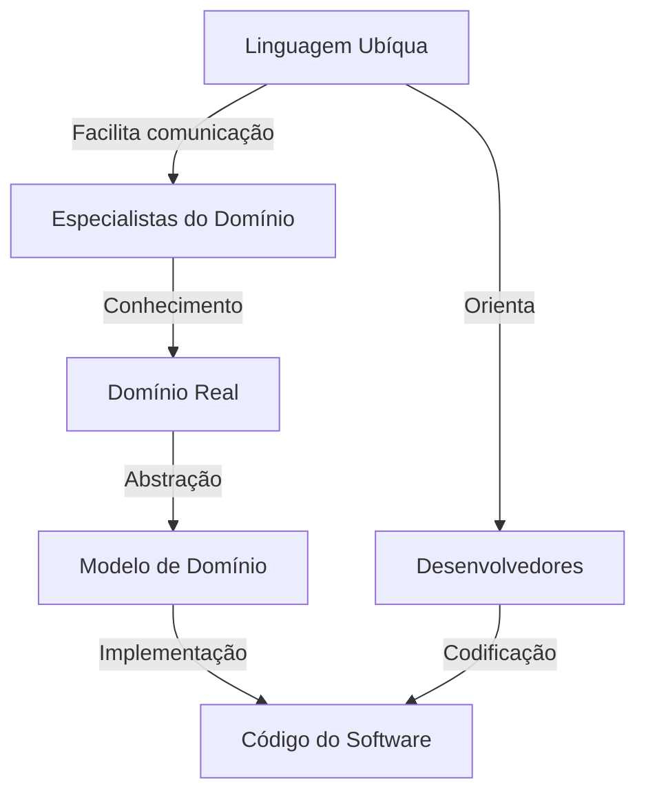

## Linguagem Ubíqua

A **Linguagem Ubíqua** (ou Onipresente) é um dos conceitos mais fundamentais e transformadores do Domain-Driven Design. Trata-se de uma linguagem compartilhada entre todos os membros da equipe - desenvolvedores, especialistas do domínio, gerentes de produto e outros stakeholders - usada consistentemente em todas as formas de comunicação.

### Características da Linguagem Ubíqua

1. **Compartilhada**: É compreendida e utilizada tanto por especialistas do domínio quanto por desenvolvedores.
2. **Precisa**: Cada termo tem um significado específico e bem definido.
3. **Evolutiva**: Evolui à medida que o entendimento do domínio se aprofunda.
4. **Documentada**: Frequentemente capturada em glossários, diagramas ou outros artefatos.
5. **Incorporada ao código**: Os termos da Linguagem Ubíqua são diretamente refletidos no código (nomes de classes, métodos, variáveis).

### Importância da Linguagem Ubíqua

A Linguagem Ubíqua resolve um problema fundamental no desenvolvimento de software: a desconexão entre a linguagem dos especialistas do domínio e a linguagem dos desenvolvedores. Quando essas linguagens divergem, surgem mal-entendidos, requisitos são interpretados incorretamente e o software acaba não refletindo adequadamente as necessidades do negócio.

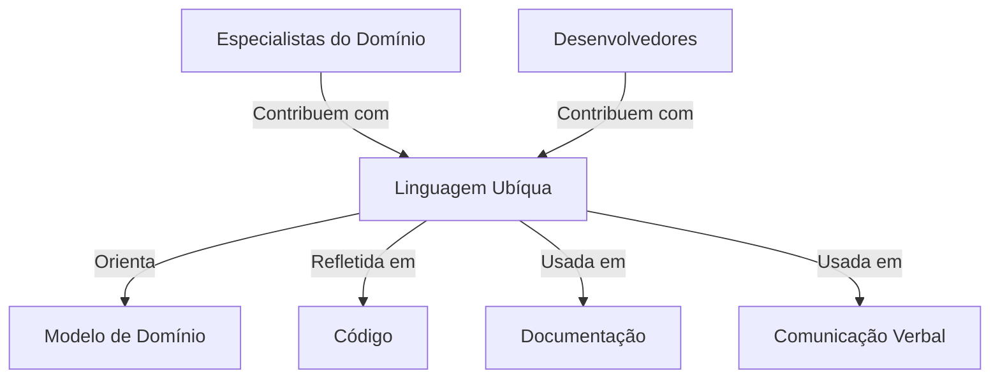

### Construindo a Linguagem Ubíqua

A construção da Linguagem Ubíqua é um processo contínuo que envolve:

1. **Workshops e discussões**: Sessões onde desenvolvedores e especialistas do domínio exploram conceitos juntos.
2. **Documentação ativa**: Captura de termos e definições em documentos vivos que evoluem.
3. **Refatoração linguística**: Revisão e refinamento contínuo dos termos à medida que o entendimento melhora.
4. **Imersão no domínio**: Desenvolvedores passam tempo observando e aprendendo com especialistas do domínio.

A Linguagem Ubíqua não é apenas uma lista de termos - é um reflexo do modelo mental compartilhado sobre o domínio. Quando bem implementada, ela reduz drasticamente a fricção comunicativa e aumenta a probabilidade de o software atender às reais necessidades do negócio.

## Contextos Delimitados (Bounded Contexts)

Os **Contextos Delimitados** (Bounded Contexts) são uma das contribuições mais significativas do DDD para a arquitetura de software. Eles reconhecem que em sistemas grandes e complexos, manter um modelo único e coerente para todo o sistema é praticamente impossível.

### Definição e Propósito

Um Contexto Delimitado é uma fronteira explícita dentro da qual um modelo de domínio específico se aplica. Esta fronteira define onde determinados termos, conceitos e regras têm significados consistentes.

Os Contextos Delimitados servem para:

1. **Gerenciar complexidade**: Dividindo o sistema em contextos menores e mais gerenciáveis.
2. **Preservar integridade conceitual**: Garantindo que cada modelo seja internamente consistente.
3. **Facilitar o trabalho em equipe**: Permitindo que diferentes equipes trabalhem em diferentes contextos com autonomia.
4. **Acomodar inconsistências naturais**: Reconhecendo que diferentes partes do negócio podem usar os mesmos termos com significados diferentes.

### Identificação de Contextos Delimitados

Os Contextos Delimitados geralmente se alinham com:

- **Subdomínios do negócio**: Diferentes áreas funcionais da organização.
- **Estruturas organizacionais**: Departamentos ou equipes com responsabilidades distintas.
- **Sistemas legados**: Sistemas existentes que precisam ser integrados.
- **Diferentes requisitos de consistência**: Áreas com diferentes necessidades de integridade de dados.

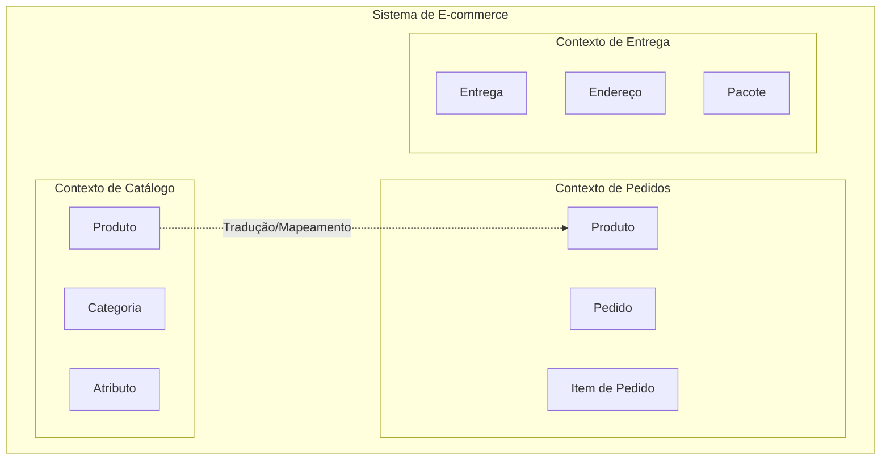

No diagrama acima, note que "Produto" aparece em dois contextos diferentes, potencialmente com atributos e comportamentos diferentes em cada um.

### Relações entre Contextos Delimitados

Quando diferentes Contextos Delimitados precisam interagir, o DDD define vários padrões de relacionamento:

1. **Partnership (Parceria)**: Duas equipes coordenam seus esforços para alinhar seus contextos.
2. **Shared Kernel (Núcleo Compartilhado)**: Uma parte do modelo é compartilhada entre contextos.
3. **Customer-Supplier (Cliente-Fornecedor)**: Um contexto (fornecedor) serve às necessidades de outro (cliente).
4. **Conformist (Conformista)**: Um contexto se adapta ao modelo de outro sem influenciá-lo.
5. **Anticorruption Layer (Camada Anticorrupção)**: Uma camada de tradução que protege um contexto da influência de outro.
6. **Open Host Service (Serviço Anfitrião Aberto)**: Um contexto publica uma API para integração.
7. **Published Language (Linguagem Publicada)**: Um formato de dados compartilhado para comunicação entre contextos.

## Subdomínios

Enquanto os Contextos Delimitados são uma construção de solução (como organizamos nosso software), os **Subdomínios** são uma realidade do domínio do problema (como o negócio é naturalmente dividido).

### Tipos de Subdomínios

O DDD identifica três tipos principais de subdomínios:

#### 1. Subdomínios Core (Núcleo)

- Representam a vantagem competitiva da organização.
- São únicos e diferenciadores.
- Merecem o maior investimento em termos de modelagem e design.
- Exemplo: Para uma seguradora, o cálculo de risco e precificação de apólices.

#### 2. Subdomínios de Suporte

- Específicos para o negócio, mas não oferecem vantagem competitiva.
- Necessários para o funcionamento do negócio.
- Exemplo: Para uma seguradora, o gerenciamento de sinistros.

#### 3. Subdomínios Genéricos

- Não são específicos para o negócio.
- Poderiam ser terceirizados ou adquiridos como soluções prontas.
- Exemplo: Autenticação de usuários, notificações por e-mail.

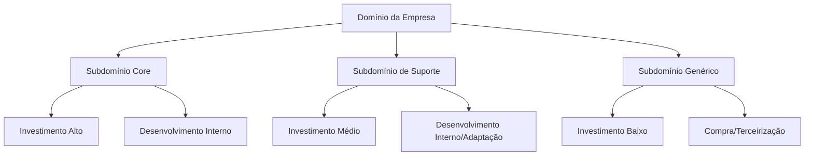

### Alinhamento entre Subdomínios e Contextos Delimitados

Idealmente, cada subdomínio deveria corresponder a um Contexto Delimitado. No entanto, na prática:

- Um subdomínio complexo pode ser dividido em múltiplos Contextos Delimitados.
- Múltiplos subdomínios pequenos podem ser agrupados em um único Contexto Delimitado.
- Subdomínios genéricos podem ser implementados como serviços compartilhados.

A identificação clara dos subdomínios ajuda a priorizar esforços de desenvolvimento e a escolher as estratégias técnicas mais apropriadas para cada parte do sistema.

## Conclusão

Os conceitos fundamentais do Domain-Driven Design - Domínio e Modelo de Domínio, Linguagem Ubíqua, Contextos Delimitados e Subdomínios - formam a base para uma abordagem de desenvolvimento que coloca o domínio no centro do processo. Eles fornecem um framework conceitual para gerenciar a complexidade, melhorar a comunicação e criar software que realmente reflita e atenda às necessidades do negócio.

Estes conceitos não são apenas abstrações teóricas, mas ferramentas práticas que, quando aplicadas adequadamente, levam a sistemas mais alinhados com o negócio, mais adaptáveis a mudanças e mais fáceis de entender e manter ao longo do tempo.
# Padrões Estratégicos do Domain-Driven Design

Os padrões estratégicos do Domain-Driven Design fornecem orientações para lidar com a complexidade em larga escala, ajudando a definir a estrutura geral do sistema e as relações entre suas diferentes partes. Estes padrões são particularmente valiosos em sistemas grandes e complexos, onde múltiplas equipes trabalham em diferentes áreas do software.

## Mapeamento de Contexto (Context Mapping)

O **Mapeamento de Contexto** é uma técnica essencial no DDD que documenta e visualiza como diferentes Contextos Delimitados se relacionam entre si. Este mapeamento é crucial porque, em sistemas complexos, nenhum contexto existe isoladamente - eles precisam interagir e compartilhar dados.

### Propósito do Mapeamento de Contexto

1. **Visualizar o sistema como um todo**: Proporcionar uma visão holística da arquitetura do sistema.
2. **Documentar integrações**: Esclarecer como diferentes partes do sistema se comunicam.
3. **Identificar riscos**: Destacar áreas de potencial conflito ou complexidade.
4. **Facilitar decisões organizacionais**: Ajudar a determinar estruturas de equipe e responsabilidades.
5. **Planejar evolução**: Fornecer uma base para planejar mudanças e melhorias no sistema.

### Representação Visual

O Mapeamento de Contexto é frequentemente representado através de diagramas que mostram os Contextos Delimitados como caixas e suas relações como linhas conectoras, com símbolos ou anotações indicando o tipo de relacionamento.

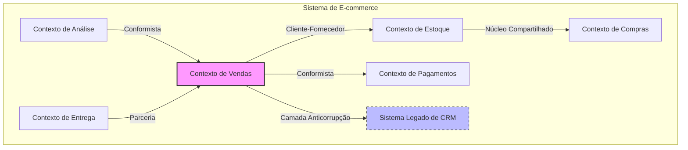

## Tipos de Relacionamentos entre Contextos

O DDD define vários padrões para descrever como os Contextos Delimitados se relacionam entre si. Cada padrão tem implicações diferentes para a integração técnica e a colaboração entre equipes.

### 1. Partnership (Parceria)

**Definição**: Duas equipes estabelecem uma relação de parceria, onde colaboram ativamente para garantir que seus respectivos contextos funcionem bem juntos.

**Características**:
- Comunicação bidirecional frequente
- Planejamento conjunto de interfaces e integrações
- Compromisso mútuo com o sucesso

**Quando usar**:
- Quando os contextos são altamente interdependentes
- Quando as equipes podem colaborar estreitamente
- Quando ambos os contextos são igualmente importantes para o negócio

### 2. Shared Kernel (Núcleo Compartilhado)

**Definição**: Uma parte do modelo de domínio é compartilhada entre dois ou mais contextos, sendo mantida em conjunto pelas equipes responsáveis.

**Características**:
- Código ou modelo compartilhado
- Necessidade de coordenação para mudanças
- Testes compartilhados

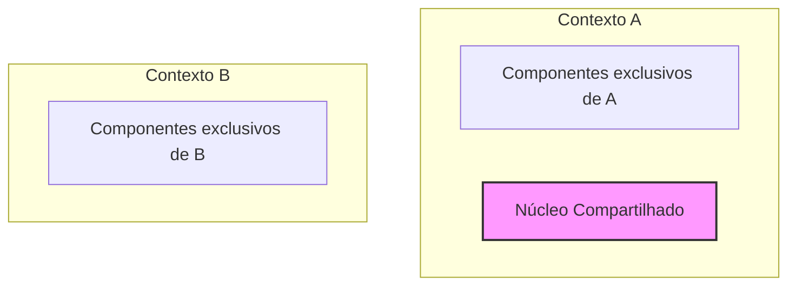

**Quando usar**:
- Quando há conceitos genuinamente comuns entre contextos
- Quando a duplicação seria custosa ou propensa a erros
- Quando as equipes podem coordenar mudanças efetivamente

**Riscos**:
- Acoplamento excessivo entre contextos
- Dificuldade em evoluir o núcleo compartilhado
- Potencial para conflitos entre equipes

### 3. Customer-Supplier (Cliente-Fornecedor)

**Definição**: Um contexto (fornecedor) fornece serviços ou dados que outro contexto (cliente) consome, com o fornecedor tendo prioridade nas decisões.

**Características**:
- Relação unidirecional
- O fornecedor define a interface
- O cliente depende do fornecedor

**Quando usar**:
- Quando um contexto claramente serve ao outro
- Quando o fornecedor tem múltiplos clientes
- Quando o fornecedor precisa de autonomia para evoluir

### 4. Conformist (Conformista)

**Definição**: Similar à relação Cliente-Fornecedor, mas o cliente não tem influência sobre o fornecedor e deve simplesmente aceitar e se adaptar ao modelo do fornecedor.

**Características**:
- O cliente adapta-se completamente ao modelo do fornecedor
- Não há negociação de interface
- Geralmente ocorre com sistemas legados ou externos

**Quando usar**:
- Quando o cliente não tem influência sobre o fornecedor
- Quando o fornecedor é um sistema externo ou legado
- Quando a simplicidade é mais importante que a otimização

### 5. Anticorruption Layer (Camada Anticorrupção)

**Definição**: Uma camada de tradução que isola um contexto da influência de outro, convertendo dados e requisições entre os diferentes modelos.

**Características**:
- Tradução bidirecional entre modelos
- Isolamento do modelo interno
- Complexidade adicional justificada pela proteção

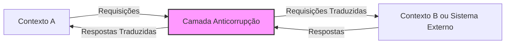

**Quando usar**:
- Quando o modelo externo é incompatível com o modelo interno
- Quando se integra com sistemas legados problemáticos
- Quando se deseja proteger a integridade do modelo interno

### 6. Open Host Service (Serviço Anfitrião Aberto)

**Definição**: Um contexto define um protocolo ou interface que dá acesso às suas funcionalidades como um conjunto de serviços, facilitando a integração para múltiplos consumidores.

**Características**:
- API bem definida e estável
- Documentação clara
- Suporte para múltiplos clientes

**Quando usar**:
- Quando um contexto serve múltiplos outros contextos
- Quando se deseja minimizar o acoplamento
- Quando a interface pode ser estabilizada

### 7. Published Language (Linguagem Publicada)

**Definição**: Um formato de dados bem documentado usado para comunicação entre contextos, frequentemente combinado com Open Host Service.

**Características**:
- Formato de dados padronizado (XML, JSON, etc.)
- Documentação formal (esquemas, contratos)
- Evolução controlada

**Quando usar**:
- Em conjunto com Open Host Service
- Quando múltiplos contextos precisam compartilhar dados
- Quando a estabilidade da comunicação é crucial

## Destilação do Domínio

A **Destilação do Domínio** é o processo de identificar e separar os conceitos mais importantes e valiosos do domínio, distinguindo-os dos aspectos genéricos ou de suporte.

### Núcleo do Domínio (Core Domain)

O **Núcleo do Domínio** representa a parte mais valiosa e diferenciadora do sistema - aquela que oferece vantagem competitiva e que justifica o desenvolvimento do software em primeiro lugar.

**Características do Núcleo do Domínio**:
- Representa a competência central da organização
- É único e diferenciador
- Contém a lógica de negócio mais complexa e valiosa
- Merece o maior investimento em termos de modelagem e design
- Deve ser desenvolvido pelos membros mais experientes da equipe

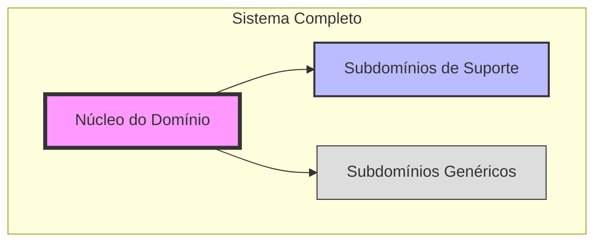

### Estratégias de Destilação

1. **Refatoração para Insight**: Refinar continuamente o modelo para revelar conceitos mais profundos.
2. **Declaração de Núcleo**: Documentar explicitamente o que constitui o núcleo do domínio.
3. **Segregação por Valor Estratégico**: Classificar componentes com base em seu valor para o negócio.
4. **Abstrações Coesas**: Criar abstrações que capturem a essência do domínio.
5. **Contextos Separados para Especialização**: Isolar áreas que requerem expertise específica.

## Grandes Estruturas (Large-Scale Structure)

As **Grandes Estruturas** são padrões de alto nível que proporcionam coerência a um sistema grande e complexo, sem restringir a evolução dos modelos individuais.

### Tipos de Grandes Estruturas

1. **Sistema Evolutivo**: A estrutura emerge e evolui com o sistema.
2. **Sistema Responsabilidade-Interação**: Organização baseada em responsabilidades e interações.
3. **Sistema Coeso Baseado em Conhecimento**: Organização baseada em áreas de conhecimento.
4. **Sistema Pluggable**: Componentes podem ser adicionados ou substituídos facilmente.

### Princípios para Grandes Estruturas

1. **Evolução Baseada em Uso Real**: A estrutura deve evoluir com base na experiência prática.
2. **Controle Responsável**: Equilíbrio entre controle e autonomia.
3. **Nível de Abstração Apropriado**: Nem muito concreto, nem muito abstrato.
4. **Conformidade Verificável**: Deve ser possível verificar se o sistema segue a estrutura.

## Conclusão

Os padrões estratégicos do Domain-Driven Design fornecem um conjunto de ferramentas conceituais para lidar com a complexidade em larga escala. Eles ajudam a definir a estrutura geral do sistema, as relações entre suas diferentes partes e a identificar as áreas que merecem maior investimento.

Estes padrões não são apenas abstrações teóricas, mas guias práticos para decisões arquiteturais e organizacionais. Quando aplicados adequadamente, eles ajudam a criar sistemas que são não apenas tecnicamente sólidos, mas também alinhados com as necessidades e prioridades do negócio.

O valor real dos padrões estratégicos está em sua capacidade de facilitar a comunicação e colaboração entre equipes, proporcionar uma visão compartilhada do sistema e permitir que o software evolua de maneira controlada e coerente ao longo do tempo.
# Padrões Táticos do Domain-Driven Design

Os padrões táticos do Domain-Driven Design fornecem diretrizes concretas para implementar modelos de domínio eficazes. Enquanto os padrões estratégicos lidam com a estrutura geral do sistema e as relações entre suas partes, os padrões táticos focam na implementação detalhada dentro de um Contexto Delimitado específico.

## Entidades

As **Entidades** são objetos que possuem uma identidade única que persiste ao longo do tempo, independentemente de mudanças em seus atributos.

### Características das Entidades

1. **Identidade**: Cada entidade possui um identificador único que a distingue de todas as outras instâncias da mesma classe.
2. **Mutabilidade**: Os atributos de uma entidade podem mudar ao longo do tempo, mas sua identidade permanece constante.
3. **Continuidade**: Uma entidade mantém sua identidade através de diferentes estados e representações.
4. **Comportamento**: Entidades encapsulam tanto dados quanto comportamentos relacionados ao domínio.

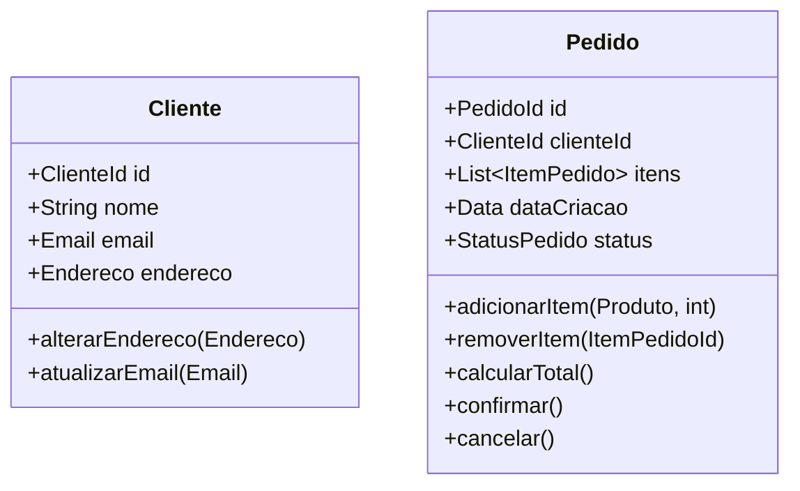

### Implementação de Entidades

1. **Identidade Explícita**: Implementar a identidade como um atributo explícito, preferencialmente usando um tipo de valor dedicado (ex: `ClienteId` em vez de apenas `int`).
2. **Igualdade por Identidade**: Duas entidades são consideradas iguais apenas se suas identidades forem iguais.
3. **Encapsulamento**: Proteger a consistência interna através de encapsulamento adequado.
4. **Comportamento Rico**: Incluir métodos que implementam regras de negócio relevantes para a entidade.

### Quando Usar Entidades

- Quando o objeto precisa ser rastreado individualmente ao longo do tempo
- Quando a identidade é mais importante que os atributos
- Quando o objeto tem um ciclo de vida significativo
- Quando o objeto encapsula regras de negócio importantes

## Objetos de Valor (Value Objects)

Os **Objetos de Valor** são objetos que representam conceitos descritivos do domínio, definidos apenas por seus atributos, sem identidade própria.

### Características dos Objetos de Valor

1. **Imutabilidade**: Uma vez criados, seus valores não podem ser alterados.
2. **Igualdade por Atributos**: Dois objetos de valor são iguais se todos os seus atributos forem iguais.
3. **Ausência de Efeitos Colaterais**: Métodos em objetos de valor não devem modificar seu estado.
4. **Composabilidade**: Objetos de valor podem ser compostos para formar estruturas mais complexas.

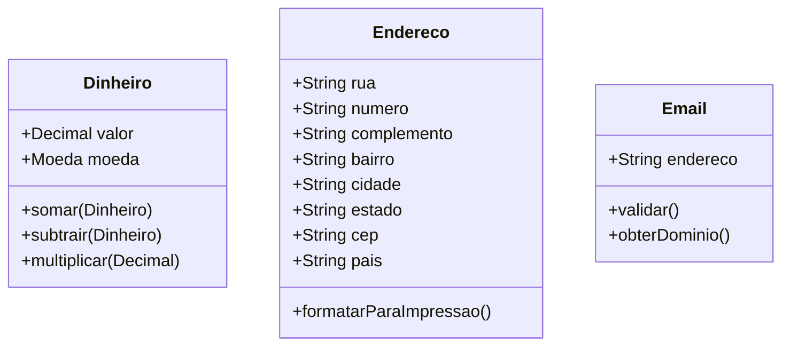

### Implementação de Objetos de Valor

1. **Construtor Completo**: Todos os atributos são definidos na criação.
2. **Sem Setters**: Não fornecer métodos que alterem o estado interno.
3. **Métodos Funcionais**: Operações retornam novos objetos em vez de modificar o existente.
4. **Validação na Criação**: Garantir que o objeto seja criado em estado válido.
5. **Sobrescrever Equals e HashCode**: Implementar corretamente a comparação baseada em atributos.

### Quando Usar Objetos de Valor

- Quando apenas os atributos importam, não a identidade
- Quando a imutabilidade é desejável
- Para representar medidas, quantidades ou descrições
- Como componentes de entidades ou outros objetos de valor

## Agregados

Os **Agregados** são clusters de objetos relacionados tratados como uma unidade para propósitos de alteração de dados. Cada agregado tem uma raiz (entidade) e um limite que define o que está dentro do agregado.

### Características dos Agregados

1. **Raiz de Agregado**: Uma entidade que serve como ponto de entrada único para o agregado.
2. **Limite de Consistência**: Define uma fronteira dentro da qual as invariantes devem ser mantidas.
3. **Identidade Global vs. Local**: Apenas a raiz tem identidade global; outras entidades têm identidade local.
4. **Referências Externas**: Objetos externos só podem referenciar a raiz do agregado.
5. **Transações Atômicas**: Mudanças dentro de um agregado são persistidas em uma única transação.

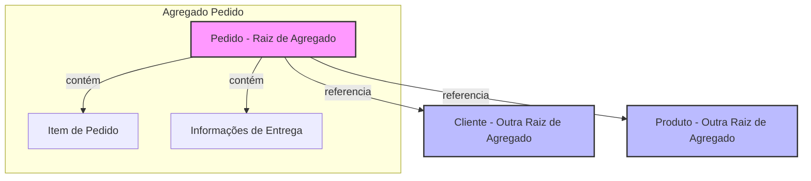

### Regras para Design de Agregados

1. **Proteger Invariantes de Negócio**: O agregado deve garantir que todas as regras de negócio sejam respeitadas.
2. **Manter Pequenos**: Preferir agregados menores para melhor escalabilidade e desempenho.
3. **Referenciar por Identidade**: Referenciar outros agregados apenas por sua identidade, não por objeto.
4. **Atualizar em Transações Únicas**: Modificações em um agregado devem ser atômicas.
5. **Aplicar Consistência Eventual**: Entre agregados, usar consistência eventual em vez de transações distribuídas.

### Quando Usar Agregados

- Para encapsular regras de negócio que se aplicam a múltiplos objetos relacionados
- Para definir limites claros de consistência transacional
- Para simplificar o modelo de domínio agrupando objetos relacionados
- Para proteger invariantes de negócio importantes

## Serviços de Domínio

Os **Serviços de Domínio** encapsulam operações do domínio que não pertencem naturalmente a nenhuma entidade ou objeto de valor específico.

### Características dos Serviços de Domínio

1. **Sem Estado**: Não mantêm estado entre chamadas.
2. **Operações Significativas**: Representam operações importantes no domínio.
3. **Múltiplos Objetos**: Frequentemente coordenam múltiplas entidades ou agregados.
4. **Parte do Modelo**: São parte do modelo de domínio, não da infraestrutura.

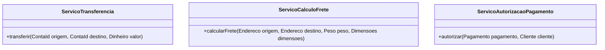

### Implementação de Serviços de Domínio

1. **Nomeação Baseada no Domínio**: Usar termos do domínio para nomear serviços.
2. **Interface Declarativa**: A interface deve expressar claramente a intenção da operação.
3. **Sem Estado Persistente**: Não armazenar estado entre chamadas.
4. **Coesão Funcional**: Cada serviço deve ter uma responsabilidade bem definida.

### Quando Usar Serviços de Domínio

- Quando uma operação envolve múltiplas entidades ou agregados
- Quando a operação não pertence naturalmente a nenhuma entidade ou objeto de valor
- Para implementar processos de negócio significativos
- Para coordenar operações complexas entre diferentes partes do modelo

## Repositórios

Os **Repositórios** fornecem uma abstração para acesso e persistência de agregados, permitindo que o modelo de domínio permaneça focado em comportamento e regras de negócio, não em detalhes de armazenamento.

### Características dos Repositórios

1. **Coleção Virtual**: Atua como uma coleção em memória de todos os agregados de um tipo.
2. **Abstração de Persistência**: Oculta os detalhes de como os objetos são armazenados e recuperados.
3. **Foco em Agregados**: Cada repositório geralmente lida com um tipo de agregado.
4. **Parte do Modelo**: Faz parte do modelo de domínio, embora sua implementação seja na infraestrutura.

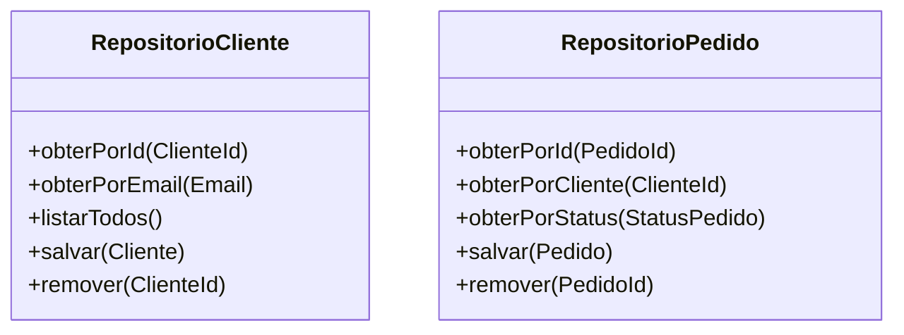

### Implementação de Repositórios

1. **Interface no Domínio**: A interface do repositório é definida na camada de domínio.
2. **Implementação na Infraestrutura**: A implementação concreta fica na camada de infraestrutura.
3. **Métodos de Busca**: Fornecer métodos para recuperar objetos por identidade e critérios relevantes.
4. **Operações de Coleção**: Implementar operações como adicionar, remover e atualizar.
5. **Abstração de Consultas**: Fornecer meios para consultas complexas sem expor detalhes de armazenamento.

### Quando Usar Repositórios

- Para fornecer acesso a agregados
- Para desacoplar o modelo de domínio da tecnologia de persistência
- Para simplificar testes, permitindo substituir a implementação real por mocks
- Para encapsular consultas complexas

## Fábricas

As **Fábricas** encapsulam a lógica necessária para criar objetos complexos ou agregados, garantindo que sejam criados em estado válido e respeitando todas as invariantes.

### Características das Fábricas

1. **Encapsulamento da Criação**: Ocultam os detalhes de como os objetos são construídos.
2. **Garantia de Invariantes**: Asseguram que os objetos criados respeitem todas as regras de negócio.
3. **Expressividade**: Tornam o processo de criação mais expressivo e alinhado com o domínio.
4. **Separação de Responsabilidades**: Removem a lógica de criação complexa das entidades e agregados.

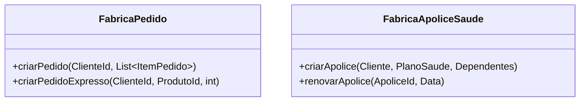

### Implementação de Fábricas

1. **Métodos Estáticos**: Para criação simples, métodos estáticos na própria classe.
2. **Classes Dedicadas**: Para lógica de criação complexa, classes de fábrica dedicadas.
3. **Interfaces Fluentes**: Para criação passo a passo de objetos complexos.
4. **Validação Completa**: Verificar todas as regras de negócio antes de retornar o objeto.

### Quando Usar Fábricas

- Quando a criação de um objeto ou agregado é complexa
- Quando a criação envolve regras de negócio significativas
- Para encapsular a construção de objetos relacionados
- Para tornar o código de criação mais expressivo e alinhado com o domínio

## Eventos de Domínio

Os **Eventos de Domínio** representam algo significativo que ocorreu no domínio. Eles capturam fatos sobre atividades no domínio e podem ser usados para desacoplar diferentes partes do sistema.

### Características dos Eventos de Domínio

1. **Fatos Imutáveis**: Representam algo que já aconteceu e não pode ser alterado.
2. **Nomeação no Passado**: Nomeados usando verbos no passado (ex: `PedidoRealizadoEvent`).
3. **Informações Relevantes**: Contêm todas as informações necessárias sobre o evento.
4. **Identificação Temporal**: Geralmente incluem timestamp e identificador único.

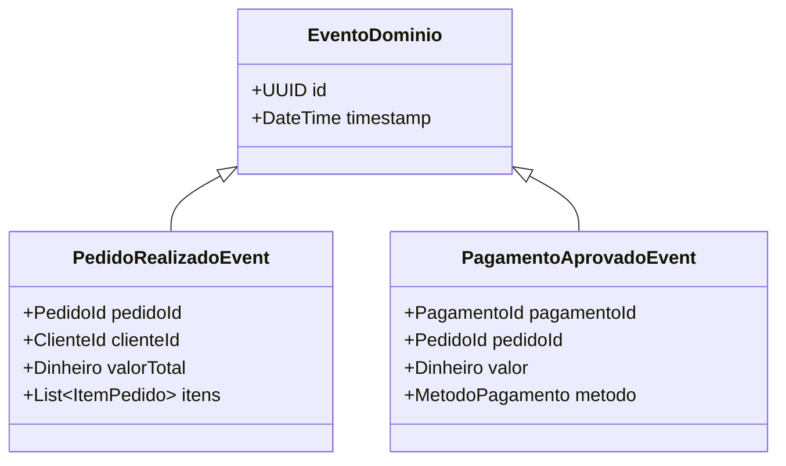

### Implementação de Eventos de Domínio

1. **Classe Imutável**: Implementar como classe imutável com todos os dados necessários.
2. **Herança ou Interface**: Usar uma classe base ou interface para todos os eventos.
3. **Publicação e Assinatura**: Implementar mecanismo para publicar eventos e permitir que componentes se inscrevam.
4. **Serialização**: Garantir que eventos possam ser serializados para armazenamento ou transmissão.

### Quando Usar Eventos de Domínio

- Para registrar ações importantes no domínio
- Para notificar outras partes do sistema sobre mudanças
- Para desacoplar componentes do sistema
- Como base para Event Sourcing (armazenamento do estado como sequência de eventos)
- Para integração entre diferentes contextos delimitados

## Módulos

Os **Módulos** são usados para organizar elementos relacionados do modelo de domínio em unidades coesas, reduzindo a complexidade e melhorando a compreensibilidade.

### Características dos Módulos

1. **Coesão Alta**: Agrupam conceitos intimamente relacionados.
2. **Acoplamento Baixo**: Minimizam dependências entre diferentes módulos.
3. **Alinhamento com o Domínio**: Refletem a estrutura conceitual do domínio.
4. **Linguagem Ubíqua**: Nomeados usando termos da Linguagem Ubíqua.

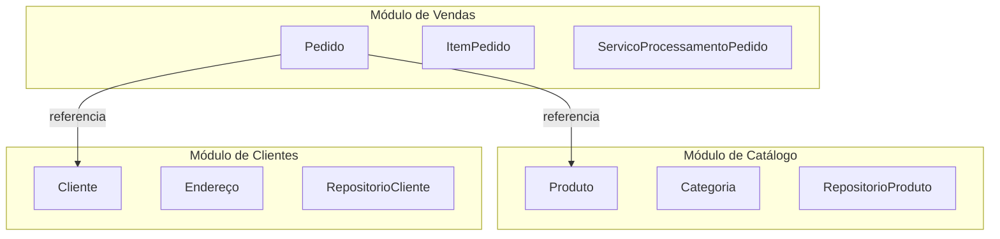

### Implementação de Módulos

1. **Pacotes/Namespaces**: Usar a estrutura de pacotes ou namespaces da linguagem.
2. **Interfaces Públicas**: Definir claramente as interfaces públicas entre módulos.
3. **Encapsulamento**: Ocultar detalhes de implementação dentro do módulo.
4. **Dependências Explícitas**: Tornar as dependências entre módulos explícitas e minimizá-las.

### Quando Usar Módulos

- Para organizar modelos de domínio grandes e complexos
- Para refletir a estrutura conceitual do domínio
- Para facilitar o trabalho em equipe, permitindo que diferentes equipes trabalhem em diferentes módulos
- Para melhorar a manutenibilidade e compreensibilidade do código

## Conclusão

Os padrões táticos do Domain-Driven Design fornecem um conjunto de ferramentas concretas para implementar modelos de domínio eficazes. Eles ajudam a traduzir conceitos do domínio em código de forma clara e expressiva, mantendo o foco nas regras de negócio e não em detalhes técnicos.

Estes padrões não devem ser aplicados mecanicamente, mas sim adaptados às necessidades específicas do domínio e do projeto. O objetivo não é seguir rigidamente os padrões, mas usar o que for apropriado para criar um modelo que capture efetivamente a essência do domínio e suporte as necessidades do negócio.

Quando aplicados adequadamente, os padrões táticos do DDD resultam em código que é não apenas tecnicamente sólido, mas também expressivo, alinhado com o negócio e capaz de evoluir com as mudanças no domínio.
# Arquitetura e Implementação no Domain-Driven Design

O Domain-Driven Design não é apenas uma abordagem conceitual para modelagem de domínio, mas também oferece diretrizes valiosas para a arquitetura e implementação de sistemas de software. Esta seção explora como os princípios do DDD se traduzem em arquiteturas concretas e práticas de implementação.

## Arquitetura em Camadas

A **Arquitetura em Camadas** é uma das abordagens arquiteturais mais comuns no contexto do DDD. Ela organiza o sistema em camadas distintas, cada uma com responsabilidades específicas, promovendo a separação de preocupações e facilitando a manutenção e evolução do software.

### Camadas Tradicionais no DDD

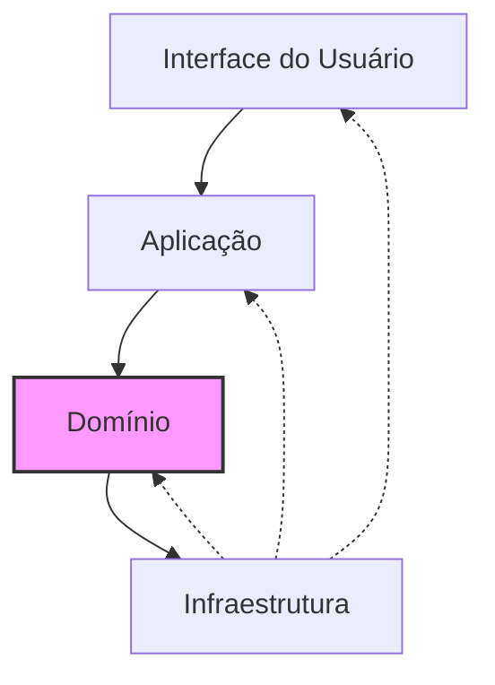

1. **Camada de Interface do Usuário (UI)**
   - Responsável pela interação com o usuário
   - Apresenta informações e captura entradas
   - Exemplos: interfaces web, APIs REST, interfaces de linha de comando

2. **Camada de Aplicação**
   - Coordena atividades do domínio
   - Não contém regras de negócio
   - Orquestra fluxos de trabalho
   - Traduz entre a UI e o modelo de domínio
   - Exemplos: serviços de aplicação, controladores, casos de uso

3. **Camada de Domínio**
   - Contém o modelo de domínio
   - Implementa regras de negócio
   - Expressa conceitos do domínio
   - É o coração do sistema
   - Exemplos: entidades, objetos de valor, agregados, serviços de domínio

4. **Camada de Infraestrutura**
   - Fornece capacidades técnicas
   - Implementa persistência, mensageria, etc.
   - Suporta as outras camadas
   - Exemplos: repositórios, adaptadores para sistemas externos, implementações de serviços técnicos

### Princípios da Arquitetura em Camadas no DDD

1. **Dependências Unidirecionais**: Camadas superiores dependem de camadas inferiores, não o contrário.
2. **Isolamento do Domínio**: A camada de domínio não deve depender de outras camadas.
3. **Inversão de Dependência**: Usar interfaces para inverter dependências quando necessário.
4. **Camadas Fechadas vs. Abertas**: Decidir se uma camada pode ser "pulada" (aberta) ou não (fechada).

### Benefícios da Arquitetura em Camadas

- **Separação de Preocupações**: Cada camada tem responsabilidades bem definidas.
- **Testabilidade**: Facilita testes unitários e de integração.
- **Flexibilidade**: Permite substituir implementações de camadas específicas.
- **Compreensibilidade**: Torna o sistema mais fácil de entender e manter.

## Arquitetura Hexagonal (Ports and Adapters)

A **Arquitetura Hexagonal**, também conhecida como "Ports and Adapters", foi proposta por Alistair Cockburn e é altamente compatível com os princípios do DDD. Ela visa isolar o núcleo da aplicação (domínio) de detalhes externos como UI, banco de dados e sistemas externos.

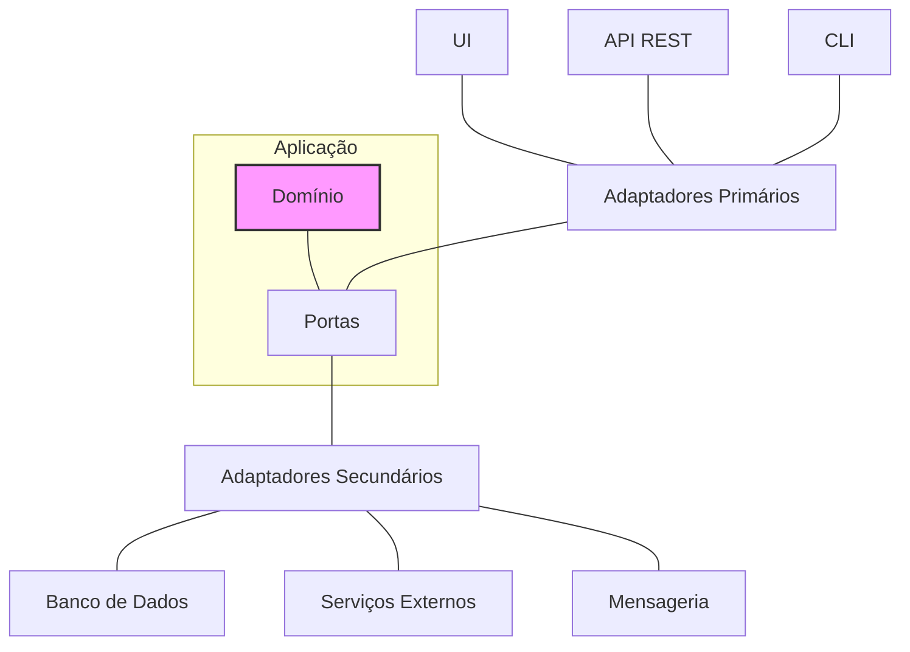

### Componentes da Arquitetura Hexagonal

1. **Domínio**: O núcleo da aplicação, contendo a lógica de negócio e o modelo de domínio.
2. **Portas**: Interfaces que definem como o domínio interage com o mundo exterior.
   - **Portas Primárias**: Para atores que conduzem a aplicação (ex: interfaces de serviço).
   - **Portas Secundárias**: Para serviços que a aplicação conduz (ex: interfaces de repositório).
3. **Adaptadores**: Implementações concretas que conectam o domínio ao mundo exterior.
   - **Adaptadores Primários**: Traduzem solicitações externas para o domínio (ex: controladores REST).
   - **Adaptadores Secundários**: Conectam o domínio a serviços externos (ex: implementações de repositório).

### Benefícios da Arquitetura Hexagonal

- **Isolamento do Domínio**: Protege o domínio de detalhes técnicos externos.
- **Testabilidade**: Facilita testes substituindo adaptadores por mocks.
- **Flexibilidade**: Permite trocar implementações técnicas sem afetar o domínio.
- **Evolução Independente**: Diferentes partes do sistema podem evoluir separadamente.

## Arquitetura Limpa (Clean Architecture)

A **Arquitetura Limpa**, proposta por Robert C. Martin (Uncle Bob), é uma evolução da Arquitetura Hexagonal e compartilha muitos princípios com o DDD. Ela enfatiza a separação de preocupações e a independência de frameworks e detalhes técnicos.

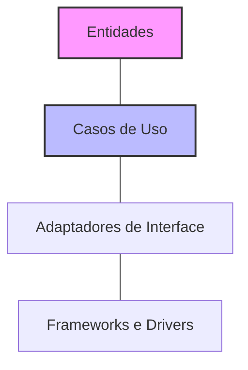

### Camadas da Arquitetura Limpa

1. **Entidades**: Encapsulam regras de negócio críticas da empresa (similar ao modelo de domínio no DDD).
2. **Casos de Uso**: Contêm regras de negócio específicas da aplicação (similar aos serviços de aplicação no DDD).
3. **Adaptadores de Interface**: Convertem dados entre o formato mais conveniente para casos de uso e entidades e o formato mais conveniente para alguma agência externa.
4. **Frameworks e Drivers**: Contêm frameworks e ferramentas como o banco de dados, o framework web, etc.

### Regra de Dependência

A regra fundamental da Arquitetura Limpa é que as dependências de código só podem apontar para dentro, em direção às políticas de alto nível (entidades e casos de uso). Camadas internas não devem saber nada sobre camadas externas.

### Benefícios da Arquitetura Limpa

- **Independência de Frameworks**: O sistema não depende da existência de bibliotecas específicas.
- **Testabilidade**: A lógica de negócio pode ser testada sem UI, banco de dados, servidor web, etc.
- **Independência de UI**: A UI pode mudar facilmente sem afetar o resto do sistema.
- **Independência de Banco de Dados**: O banco de dados pode ser trocado sem afetar a lógica de negócio.

## CQRS (Command Query Responsibility Segregation)

**CQRS** é um padrão arquitetural que separa as operações de leitura (queries) das operações de escrita (commands) em um sistema. Embora não seja exclusivo do DDD, ele se integra bem com os princípios do DDD e é frequentemente usado em conjunto.

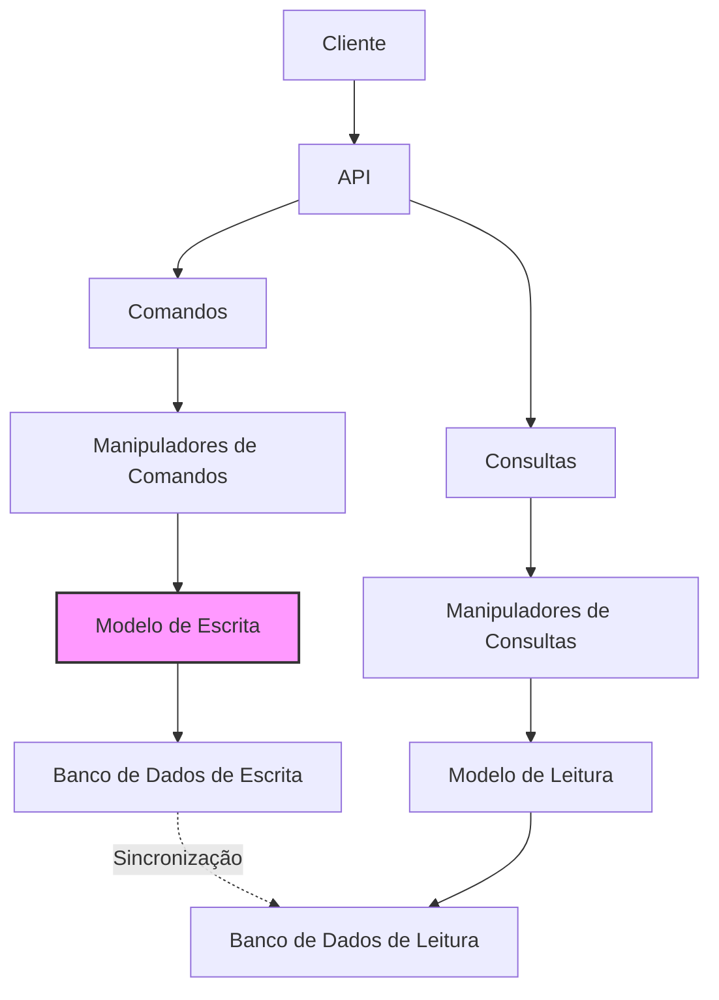

### Componentes do CQRS

1. **Comandos**: Representam intenções de mudança de estado (ex: `CriarPedidoCommand`).
2. **Consultas**: Solicitações de informações sem efeitos colaterais (ex: `ObterPedidosPorClienteQuery`).
3. **Manipuladores de Comandos**: Processam comandos e aplicam mudanças no modelo de escrita.
4. **Manipuladores de Consultas**: Processam consultas e retornam dados do modelo de leitura.
5. **Modelo de Escrita**: Otimizado para consistência e validação (geralmente usa o modelo de domínio DDD).
6. **Modelo de Leitura**: Otimizado para consultas (geralmente desnormalizado).

### Variações de CQRS

1. **CQRS Simples**: Mesma base de dados, diferentes modelos para leitura e escrita.
2. **CQRS com Bancos Separados**: Bancos de dados separados para leitura e escrita.
3. **CQRS com Event Sourcing**: Eventos como fonte primária de verdade, projeções para leitura.

### Quando Usar CQRS

- **Desbalanceamento de Carga**: Quando há muito mais leituras que escritas (ou vice-versa).
- **Modelos Complexos**: Quando o modelo otimizado para regras de negócio é diferente do modelo ideal para consultas.
- **Escalabilidade**: Quando é necessário escalar leituras e escritas independentemente.
- **Colaboração em Equipe**: Quando diferentes equipes trabalham em aspectos de leitura e escrita.

### Desafios do CQRS

- **Complexidade Adicional**: Dois modelos para manter.
- **Consistência Eventual**: Pode haver atraso entre escrita e disponibilidade para leitura.
- **Curva de Aprendizado**: Requer mudança de mentalidade para desenvolvedores.

## Event Sourcing

**Event Sourcing** é um padrão arquitetural onde o estado de um sistema é determinado por uma sequência de eventos, em vez de apenas o estado atual. Cada mudança no sistema é capturada como um evento imutável, e o estado atual pode ser reconstruído reproduzindo esses eventos.

```mermaid
graph TD
    A[Comando] --> B[Manipulador de Comando]
    B --> C[Agregado]
    C --> D[Eventos de Domínio]
    D --> E[Armazenamento de Eventos]
    E --> F[Projeções]
    F --> G[Modelos de Leitura]
    E --> H[Reconstrução de Estado]
    H --> C
    
    style D fill:#f9f,stroke:#333,stroke-width:2px
```

### Componentes do Event Sourcing

1. **Eventos de Domínio**: Registros imutáveis de algo que aconteceu no sistema.
2. **Armazenamento de Eventos**: Banco de dados que armazena a sequência de eventos.
3. **Projeções**: Processam eventos para criar visões otimizadas para consulta.
4. **Reconstrução de Estado**: Processo de reproduzir eventos para recuperar o estado atual.

### Benefícios do Event Sourcing

- **Auditoria Completa**: Histórico completo de todas as mudanças.
- **Depuração Temporal**: Possibilidade de reconstruir o estado em qualquer ponto no tempo.
- **Evolução do Modelo**: Facilita a evolução do modelo adicionando novas projeções.
- **Desempenho de Escrita**: Escritas são apenas anexações (append-only), geralmente rápidas.
- **Correção de Erros**: Possibilidade de corrigir erros reproduzindo eventos com correções.

### Desafios do Event Sourcing

- **Complexidade**: Requer infraestrutura e padrões específicos.
- **Consultas Complexas**: Consultas ad-hoc podem ser difíceis.
- **Versionamento de Eventos**: Gerenciar mudanças na estrutura dos eventos ao longo do tempo.
- **Desempenho de Reconstrução**: Reconstruir estado a partir de muitos eventos pode ser lento.

## Integração com Microsserviços

O DDD e os microsserviços são altamente complementares. Os Contextos Delimitados do DDD fornecem uma base conceitual sólida para definir limites de microsserviços.

```mermaid
graph TD
    subgraph "Microsserviço de Catálogo"
        A[Contexto Delimitado de Catálogo]
    end
    
    subgraph "Microsserviço de Pedidos"
        B[Contexto Delimitado de Pedidos]
    end
    
    subgraph "Microsserviço de Clientes"
        C[Contexto Delimitado de Clientes]
    end
    
    B -->|API REST| A
    B -->|Mensageria| C
    
    style A fill:#bbf,stroke:#333,stroke-width:2px
    style B fill:#f9f,stroke:#333,stroke-width:2px
    style C fill:#bbf,stroke:#333,stroke-width:2px
```

### Princípios para Microsserviços Baseados em DDD

1. **Alinhamento com Contextos Delimitados**: Cada microsserviço deve corresponder a um ou mais Contextos Delimitados.
2. **Autonomia**: Cada microsserviço deve ser capaz de funcionar independentemente.
3. **Dados Privados**: Cada microsserviço deve ter seu próprio armazenamento de dados.
4. **Integração Assíncrona**: Preferir comunicação assíncrona entre serviços quando possível.
5. **API Bem Definida**: Cada serviço deve ter uma API clara baseada na Linguagem Ubíqua.

### Padrões de Integração entre Microsserviços

1. **API REST/GraphQL**: Para comunicação síncrona.
2. **Mensageria**: Para comunicação assíncrona baseada em mensagens.
3. **Event-Driven**: Serviços publicam e assinam eventos.
4. **Saga**: Coordena transações distribuídas entre serviços.
5. **API Gateway**: Fornece um ponto de entrada unificado para clientes.

### Desafios da Integração de Microsserviços

- **Consistência de Dados**: Manter consistência entre serviços.
- **Transações Distribuídas**: Gerenciar operações que abrangem múltiplos serviços.
- **Descoberta de Serviços**: Localizar e se comunicar com outros serviços.
- **Resiliência**: Lidar com falhas de serviços dependentes.

## Implementação Prática do DDD

A implementação prática do DDD envolve traduzir os conceitos e padrões em código real. Aqui estão algumas diretrizes e exemplos para implementação eficaz.

### Estrutura de Projeto

Uma estrutura de projeto típica para uma aplicação DDD poderia ser:

```
src/
├── Domain/                 # Camada de Domínio
│   ├── Pedidos/            # Contexto Delimitado
│   │   ├── Pedido.cs       # Entidade/Agregado
│   │   ├── ItemPedido.cs   # Entidade
│   │   ├── StatusPedido.cs # Enumeração
│   │   └── ...
│   └── Clientes/           # Outro Contexto Delimitado
│       └── ...
├── Application/            # Camada de Aplicação
│   ├── Pedidos/
│   │   ├── Commands/       # Comandos CQRS
│   │   ├── Queries/        # Consultas CQRS
│   │   └── Services/       # Serviços de Aplicação
│   └── ...
├── Infrastructure/         # Camada de Infraestrutura
│   ├── Persistence/        # Implementações de Repositório
│   ├── ExternalServices/   # Integrações Externas
│   └── ...
└── Presentation/           # Camada de Apresentação
    ├── API/                # API REST
    ├── Web/                # Interface Web
    └── ...
```

### Implementação de Entidades e Agregados

```csharp
// Exemplo em C#
namespace Domain.Pedidos
{
    public class Pedido
    {
        public PedidoId Id { get; private set; }
        public ClienteId ClienteId { get; private set; }
        private readonly List<ItemPedido> _itens = new List<ItemPedido>();
        public IReadOnlyCollection<ItemPedido> Itens => _itens.AsReadOnly();
        public StatusPedido Status { get; private set; }
        public DateTime DataCriacao { get; private set; }
        
        // Construtor privado para ORM
        private Pedido() { }
        
        // Construtor para criação de novos pedidos
        public Pedido(PedidoId id, ClienteId clienteId)
        {
            Id = id;
            ClienteId = clienteId;
            Status = StatusPedido.Rascunho;
            DataCriacao = DateTime.UtcNow;
        }
        
        // Métodos que encapsulam regras de negócio
        public void AdicionarItem(ProdutoId produtoId, string nome, decimal preco, int quantidade)
        {
            if (Status != StatusPedido.Rascunho)
                throw new InvalidOperationException("Não é possível adicionar itens a um pedido que não está em rascunho.");
                
            var item = new ItemPedido(Id, produtoId, nome, preco, quantidade);
            _itens.Add(item);
        }
        
        public void Confirmar()
        {
            if (Status != StatusPedido.Rascunho)
                throw new InvalidOperationException("Apenas pedidos em rascunho podem ser confirmados.");
                
            if (!_itens.Any())
                throw new InvalidOperationException("Não é possível confirmar um pedido sem itens.");
                
            Status = StatusPedido.Confirmado;
        }
        
        // Outros métodos de negócio...
    }
}
```

### Implementação de Objetos de Valor

```csharp
// Exemplo em C#
namespace Domain.Shared
{
    public class Dinheiro : IEquatable<Dinheiro>
    {
        public decimal Valor { get; }
        public string Moeda { get; }
        
        public Dinheiro(decimal valor, string moeda)
        {
            if (valor < 0)
                throw new ArgumentException("Valor não pode ser negativo", nameof(valor));
                
            if (string.IsNullOrWhiteSpace(moeda))
                throw new ArgumentException("Moeda é obrigatória", nameof(moeda));
                
            Valor = valor;
            Moeda = moeda;
        }
        
        // Operações que retornam novos objetos
        public Dinheiro Somar(Dinheiro outro)
        {
            if (outro.Moeda != Moeda)
                throw new InvalidOperationException("Não é possível somar valores em moedas diferentes");
                
            return new Dinheiro(Valor + outro.Valor, Moeda);
        }
        
        // Implementação de igualdade baseada em valor
        public bool Equals(Dinheiro other)
        {
            if (other is null) return false;
            return Valor == other.Valor && Moeda == other.Moeda;
        }
        
        public override bool Equals(object obj)
        {
            return obj is Dinheiro dinheiro && Equals(dinheiro);
        }
        
        public override int GetHashCode()
        {
            return HashCode.Combine(Valor, Moeda);
        }
        
        // Operadores de igualdade
        public static bool operator ==(Dinheiro left, Dinheiro right)
        {
            return left?.Equals(right) ?? right is null;
        }
        
        public static bool operator !=(Dinheiro left, Dinheiro right)
        {
            return !(left == right);
        }
    }
}
```

### Implementação de Repositórios

```csharp
// Interface no domínio
namespace Domain.Pedidos
{
    public interface IPedidoRepository
    {
        Task<Pedido> ObterPorIdAsync(PedidoId id);
        Task<IEnumerable<Pedido>> ObterPorClienteAsync(ClienteId clienteId);
        Task SalvarAsync(Pedido pedido);
        Task RemoverAsync(PedidoId id);
    }
}

// Implementação na infraestrutura
namespace Infrastructure.Persistence
{
    public class PedidoRepository : IPedidoRepository
    {
        private readonly DbContext _context;
        
        public PedidoRepository(DbContext context)
        {
            _context = context;
        }
        
        public async Task<Pedido> ObterPorIdAsync(PedidoId id)
        {
            return await _context.Pedidos
                .Include(p => p.Itens)
                .FirstOrDefaultAsync(p => p.Id == id);
        }
        
        // Implementação dos outros métodos...
    }
}
```

### Implementação de Serviços de Aplicação

```csharp
// Exemplo em C#
namespace Application.Pedidos
{
    public class PedidoService
    {
        private readonly IPedidoRepository _pedidoRepository;
        private readonly IProdutoRepository _produtoRepository;
        
        public PedidoService(IPedidoRepository pedidoRepository, IProdutoRepository produtoRepository)
        {
            _pedidoRepository = pedidoRepository;
            _produtoRepository = produtoRepository;
        }
        
        public async Task<PedidoId> CriarPedidoAsync(ClienteId clienteId, List<ItemPedidoDto> itens)
        {
            var pedidoId = new PedidoId(Guid.NewGuid());
            var pedido = new Pedido(pedidoId, clienteId);
            
            foreach (var item in itens)
            {
                var produto = await _produtoRepository.ObterPorIdAsync(new ProdutoId(item.ProdutoId));
                if (produto == null)
                    throw new ApplicationException($"Produto não encontrado: {item.ProdutoId}");
                    
                pedido.AdicionarItem(produto.Id, produto.Nome, produto.Preco, item.Quantidade);
            }
            
            await _pedidoRepository.SalvarAsync(pedido);
            return pedidoId;
        }
        
        // Outros métodos de serviço...
    }
}
```

## Conclusão

A arquitetura e implementação no Domain-Driven Design não são prescritivas, mas oferecem um conjunto de princípios e padrões que podem ser adaptados às necessidades específicas de cada projeto. O objetivo fundamental é criar uma arquitetura que suporte a expressão clara do modelo de domínio e permita que o software evolua com as mudanças no entendimento do domínio.

As abordagens arquiteturais como Arquitetura em Camadas, Arquitetura Hexagonal, Arquitetura Limpa, CQRS e Event Sourcing são complementares ao DDD e podem ser combinadas de várias maneiras para atender aos requisitos específicos do sistema. A chave é manter o foco no domínio e garantir que a arquitetura técnica sirva às necessidades do negócio, não o contrário.

Na implementação prática, o código deve refletir claramente os conceitos do domínio, com entidades, objetos de valor, agregados e outros elementos do DDD expressos de forma que tanto desenvolvedores quanto especialistas do domínio possam reconhecer e entender. Isso cria um software que não apenas funciona, mas que também comunica efetivamente sua intenção e alinhamento com o domínio de negócio.
# Aplicação Prática do Domain-Driven Design

O Domain-Driven Design não é apenas uma abordagem teórica, mas um conjunto de práticas e princípios que podem ser aplicados em projetos reais. Esta seção explora aspectos práticos da aplicação do DDD, incluindo quando usá-lo, exemplos de implementação, desafios comuns e benefícios concretos.

## Quando Usar DDD

O Domain-Driven Design é uma abordagem poderosa, mas não é adequada para todos os tipos de projetos. Compreender quando aplicar o DDD é tão importante quanto saber como aplicá-lo.

### Cenários Ideais para DDD

```mermaid
graph TD
    A[Avaliar Projeto] --> B{Domínio Complexo?}
    B -->|Sim| C{Especialistas de Domínio Disponíveis?}
    B -->|Não| D[Considerar Abordagem Mais Simples]
    C -->|Sim| E{Expectativa de Evolução?}
    C -->|Não| F[Difícil Aplicar DDD Efetivamente]
    E -->|Sim| G[DDD é Altamente Recomendado]
    E -->|Não| H[DDD Pode Ser Benéfico]
    
    style G fill:#9f9,stroke:#333,stroke-width:2px
    style H fill:#ff9,stroke:#333,stroke-width:2px
    style D fill:#f99,stroke:#333,stroke-width:2px
    style F fill:#f99,stroke:#333,stroke-width:2px
```

1. **Domínios Complexos**
   - Sistemas com regras de negócio complexas e intrincadas
   - Domínios onde a terminologia e os conceitos não são triviais
   - Exemplos: sistemas financeiros, seguros, saúde, logística

2. **Colaboração com Especialistas do Domínio**
   - Projetos onde especialistas do domínio estão disponíveis e engajados
   - Ambientes onde a comunicação entre técnicos e especialistas é valorizada
   - Situações onde o conhecimento do domínio não está bem documentado

3. **Projetos de Longo Prazo**
   - Sistemas que precisarão evoluir ao longo do tempo
   - Software que representa um investimento estratégico
   - Aplicações que precisam se adaptar a mudanças no domínio

4. **Sistemas Críticos para o Negócio**
   - Aplicações que implementam processos core do negócio
   - Software que oferece vantagem competitiva
   - Sistemas onde erros têm alto impacto

### Quando Evitar DDD

1. **Aplicações CRUD Simples**
   - Sistemas que são essencialmente operações de criar, ler, atualizar e excluir
   - Aplicações com pouca ou nenhuma lógica de negócio complexa
   - Exemplos: sistemas de gerenciamento de conteúdo básicos, blogs simples

2. **Projetos com Restrições Severas de Tempo ou Orçamento**
   - Situações onde o tempo para modelagem e design é limitado
   - Projetos com orçamento insuficiente para investir em design cuidadoso
   - MVPs (Produtos Mínimos Viáveis) com foco em validação rápida

3. **Ausência de Especialistas do Domínio**
   - Contextos onde não há acesso a especialistas do domínio
   - Situações onde a documentação do domínio é inadequada
   - Ambientes onde a colaboração entre técnicos e especialistas é difícil

4. **Domínios Bem Estabelecidos e Estáveis**
   - Sistemas em domínios que raramente mudam
   - Aplicações que implementam processos padronizados e bem documentados
   - Situações onde frameworks existentes já encapsulam o conhecimento do domínio

## Exemplos de Implementação

Para ilustrar a aplicação prática do DDD, vamos explorar exemplos em diferentes domínios, mostrando como os conceitos e padrões podem ser aplicados em situações reais.

### Exemplo 1: Sistema de E-commerce

Um sistema de e-commerce típico pode ser dividido em vários Contextos Delimitados:

```mermaid
graph TD
    subgraph "Sistema de E-commerce"
        A[Contexto de Catálogo] --- B[Contexto de Pedidos]
        B --- C[Contexto de Pagamentos]
        B --- D[Contexto de Entrega]
        E[Contexto de Clientes] --- B
        E --- F[Contexto de Marketing]
    end
    
    style B fill:#f9f,stroke:#333,stroke-width:2px
```

#### Contexto de Pedidos (Core Domain)

**Entidades e Agregados:**
```java
// Pedido como raiz de agregado
public class Pedido {
    private PedidoId id;
    private ClienteId clienteId;
    private List<ItemPedido> itens = new ArrayList<>();
    private EnderecoEntrega enderecoEntrega;
    private StatusPedido status;
    private Data dataCriacao;
    
    // Construtor e métodos de fábrica
    public static Pedido criar(ClienteId clienteId, EnderecoEntrega endereco) {
        Pedido pedido = new Pedido();
        pedido.id = new PedidoId(UUID.randomUUID());
        pedido.clienteId = clienteId;
        pedido.enderecoEntrega = endereco;
        pedido.status = StatusPedido.RASCUNHO;
        pedido.dataCriacao = Data.agora();
        return pedido;
    }
    
    // Métodos de negócio
    public void adicionarItem(ProdutoId produtoId, String nome, Dinheiro preco, int quantidade) {
        if (status != StatusPedido.RASCUNHO) {
            throw new IllegalStateException("Não é possível adicionar itens a um pedido que não está em rascunho");
        }
        
        // Verificar se o produto já existe no pedido
        for (ItemPedido item : itens) {
            if (item.getProdutoId().equals(produtoId)) {
                item.incrementarQuantidade(quantidade);
                return;
            }
        }
        
        // Adicionar novo item
        ItemPedido novoItem = new ItemPedido(produtoId, nome, preco, quantidade);
        itens.add(novoItem);
    }
    
    public void confirmar() {
        if (status != StatusPedido.RASCUNHO) {
            throw new IllegalStateException("Apenas pedidos em rascunho podem ser confirmados");
        }
        
        if (itens.isEmpty()) {
            throw new IllegalStateException("Não é possível confirmar um pedido sem itens");
        }
        
        status = StatusPedido.CONFIRMADO;
        // Publicar evento de domínio
        DomainEvents.publish(new PedidoConfirmadoEvent(id, clienteId, calcularTotal()));
    }
    
    public Dinheiro calcularTotal() {
        return itens.stream()
            .map(ItemPedido::calcularSubtotal)
            .reduce(Dinheiro.zero("BRL"), Dinheiro::somar);
    }
    
    // Outros métodos...
}
```

**Objetos de Valor:**
```java
// Objeto de valor para representar dinheiro
public final class Dinheiro {
    private final BigDecimal valor;
    private final String moeda;
    
    public Dinheiro(BigDecimal valor, String moeda) {
        if (valor == null) throw new IllegalArgumentException("Valor não pode ser nulo");
        if (moeda == null || moeda.trim().isEmpty()) throw new IllegalArgumentException("Moeda não pode ser nula ou vazia");
        
        this.valor = valor.setScale(2, RoundingMode.HALF_EVEN);
        this.moeda = moeda;
    }
    
    public static Dinheiro zero(String moeda) {
        return new Dinheiro(BigDecimal.ZERO, moeda);
    }
    
    public Dinheiro somar(Dinheiro outro) {
        if (!this.moeda.equals(outro.moeda)) {
            throw new IllegalArgumentException("Não é possível somar valores em moedas diferentes");
        }
        return new Dinheiro(this.valor.add(outro.valor), this.moeda);
    }
    
    public Dinheiro multiplicar(int quantidade) {
        return new Dinheiro(this.valor.multiply(new BigDecimal(quantidade)), this.moeda);
    }
    
    // Implementação de equals, hashCode, toString...
}
```

**Serviço de Domínio:**
```java
public class ServicoProcessamentoPedido {
    private final RepositorioPedido repositorioPedido;
    private final RepositorioProduto repositorioProduto;
    private final ServicoVerificacaoEstoque servicoEstoque;
    
    // Construtor com injeção de dependências...
    
    public void processarPedido(PedidoId pedidoId) {
        Pedido pedido = repositorioPedido.obterPorId(pedidoId)
            .orElseThrow(() -> new EntidadeNaoEncontradaException("Pedido não encontrado: " + pedidoId));
            
        // Verificar disponibilidade de estoque
        for (ItemPedido item : pedido.getItens()) {
            boolean disponivel = servicoEstoque.verificarDisponibilidade(
                item.getProdutoId(), item.getQuantidade());
                
            if (!disponivel) {
                throw new EstoqueInsuficienteException(
                    "Estoque insuficiente para o produto: " + item.getProdutoId());
            }
        }
        
        // Reservar estoque
        for (ItemPedido item : pedido.getItens()) {
            servicoEstoque.reservar(item.getProdutoId(), item.getQuantidade());
        }
        
        // Atualizar status do pedido
        pedido.processado();
        repositorioPedido.salvar(pedido);
        
        // Publicar evento
        DomainEvents.publish(new PedidoProcessadoEvent(pedidoId));
    }
}
```

### Exemplo 2: Sistema Bancário

Um sistema bancário pode ser dividido em Contextos Delimitados como Contas, Transferências, Empréstimos, etc.

#### Contexto de Transferências

**Agregado de Transferência:**
```csharp
// C#
public class Transferencia
{
    public TransferenciaId Id { get; private set; }
    public ContaId ContaOrigem { get; private set; }
    public ContaId ContaDestino { get; private set; }
    public Dinheiro Valor { get; private set; }
    public StatusTransferencia Status { get; private set; }
    public DateTime DataCriacao { get; private set; }
    public DateTime? DataConclusao { get; private set; }
    
    private Transferencia() { } // Para ORM
    
    public static Transferencia Criar(
        ContaId contaOrigem, 
        ContaId contaDestino, 
        Dinheiro valor)
    {
        if (contaOrigem == null) throw new ArgumentNullException(nameof(contaOrigem));
        if (contaDestino == null) throw new ArgumentNullException(nameof(contaDestino));
        if (valor == null) throw new ArgumentNullException(nameof(valor));
        
        if (contaOrigem.Equals(contaDestino))
            throw new ArgumentException("Conta de origem e destino não podem ser iguais");
            
        if (valor.Valor <= 0)
            throw new ArgumentException("Valor da transferência deve ser positivo");
            
        return new Transferencia
        {
            Id = new TransferenciaId(Guid.NewGuid()),
            ContaOrigem = contaOrigem,
            ContaDestino = contaDestino,
            Valor = valor,
            Status = StatusTransferencia.Pendente,
            DataCriacao = DateTime.UtcNow
        };
    }
    
    public void Aprovar()
    {
        if (Status != StatusTransferencia.Pendente)
            throw new InvalidOperationException("Apenas transferências pendentes podem ser aprovadas");
            
        Status = StatusTransferencia.Aprovada;
        // Publicar evento
    }
    
    public void Concluir()
    {
        if (Status != StatusTransferencia.Aprovada)
            throw new InvalidOperationException("Apenas transferências aprovadas podem ser concluídas");
            
        Status = StatusTransferencia.Concluida;
        DataConclusao = DateTime.UtcNow;
        
        // Publicar evento
        DomainEvents.Publish(new TransferenciaConcluida(Id, ContaOrigem, ContaDestino, Valor));
    }
    
    public void Falhar(string motivo)
    {
        if (Status == StatusTransferencia.Concluida || Status == StatusTransferencia.Falha)
            throw new InvalidOperationException("Não é possível falhar uma transferência já concluída ou falhada");
            
        Status = StatusTransferencia.Falha;
        
        // Publicar evento
        DomainEvents.Publish(new TransferenciaFalhou(Id, ContaOrigem, ContaDestino, Valor, motivo));
    }
}
```

**Serviço de Aplicação:**
```csharp
// C#
public class ServicoTransferencia
{
    private readonly IRepositorioTransferencia _repositorioTransferencia;
    private readonly IRepositorioConta _repositorioConta;
    private readonly IUnitOfWork _unitOfWork;
    
    // Construtor com injeção de dependências...
    
    public async Task<TransferenciaId> IniciarTransferencia(
        ContaId contaOrigem, 
        ContaId contaDestino, 
        decimal valor, 
        string moeda)
    {
        // Verificar se as contas existem
        var contaOrigemExiste = await _repositorioConta.ExisteAsync(contaOrigem);
        var contaDestinoExiste = await _repositorioConta.ExisteAsync(contaDestino);
        
        if (!contaOrigemExiste)
            throw new ContaNaoEncontradaException($"Conta de origem não encontrada: {contaOrigem}");
            
        if (!contaDestinoExiste)
            throw new ContaNaoEncontradaException($"Conta de destino não encontrada: {contaDestino}");
            
        // Criar transferência
        var transferencia = Transferencia.Criar(
            contaOrigem, 
            contaDestino, 
            new Dinheiro(valor, moeda));
            
        // Persistir
        await _repositorioTransferencia.AdicionarAsync(transferencia);
        await _unitOfWork.CommitAsync();
        
        // Retornar ID
        return transferencia.Id;
    }
    
    public async Task ProcessarTransferencia(TransferenciaId id)
    {
        var transferencia = await _repositorioTransferencia.ObterPorIdAsync(id);
        if (transferencia == null)
            throw new TransferenciaNaoEncontradaException($"Transferência não encontrada: {id}");
            
        var contaOrigem = await _repositorioConta.ObterPorIdAsync(transferencia.ContaOrigem);
        var contaDestino = await _repositorioConta.ObterPorIdAsync(transferencia.ContaDestino);
        
        // Verificar saldo
        if (contaOrigem.Saldo.Valor < transferencia.Valor.Valor)
        {
            transferencia.Falhar("Saldo insuficiente");
            await _repositorioTransferencia.AtualizarAsync(transferencia);
            await _unitOfWork.CommitAsync();
            return;
        }
        
        try
        {
            // Aprovar transferência
            transferencia.Aprovar();
            
            // Debitar da conta de origem
            contaOrigem.Debitar(transferencia.Valor);
            
            // Creditar na conta de destino
            contaDestino.Creditar(transferencia.Valor);
            
            // Concluir transferência
            transferencia.Concluir();
            
            // Persistir mudanças
            await _repositorioConta.AtualizarAsync(contaOrigem);
            await _repositorioConta.AtualizarAsync(contaDestino);
            await _repositorioTransferencia.AtualizarAsync(transferencia);
            await _unitOfWork.CommitAsync();
        }
        catch (Exception ex)
        {
            // Falhar transferência em caso de erro
            transferencia.Falhar(ex.Message);
            await _repositorioTransferencia.AtualizarAsync(transferencia);
            await _unitOfWork.CommitAsync();
            throw;
        }
    }
}
```

## Desafios Comuns e Como Superá-los

A implementação do DDD em projetos reais frequentemente enfrenta desafios. Reconhecer esses desafios e saber como superá-los é essencial para o sucesso.

### 1. Curva de Aprendizado Íngreme

**Desafio**: O DDD tem muitos conceitos e padrões que podem ser intimidadores para equipes não familiarizadas.

**Soluções**:
- Começar com um subconjunto de padrões e conceitos, introduzindo outros gradualmente
- Investir em treinamento e workshops para a equipe
- Usar exemplos concretos e relevantes para o domínio específico
- Considerar a contratação de um mentor ou consultor experiente em DDD

### 2. Resistência Organizacional

**Desafio**: Stakeholders podem resistir ao tempo e esforço necessários para modelagem e design adequados.

**Soluções**:
- Demonstrar o valor do DDD através de métricas relevantes para o negócio
- Começar com um projeto piloto para mostrar resultados tangíveis
- Educar stakeholders sobre os custos de longo prazo de design inadequado
- Adaptar a abordagem à cultura organizacional, introduzindo práticas gradualmente

### 3. Encontrar o Nível Certo de Abstração

**Desafio**: É difícil encontrar o equilíbrio entre modelos muito simples e excessivamente complexos.

**Soluções**:
- Focar inicialmente nos conceitos core do domínio
- Refinar o modelo iterativamente com feedback dos especialistas do domínio
- Usar técnicas como Event Storming para descobrir o modelo colaborativamente
- Não tentar modelar tudo de uma vez; permitir que o modelo evolua

### 4. Integração com Sistemas Legados

**Desafio**: Sistemas existentes frequentemente não seguem princípios de DDD e podem ser difíceis de integrar.

**Soluções**:
- Usar o padrão Anticorruption Layer para isolar o novo modelo do sistema legado
- Implementar DDD incrementalmente, começando com novos recursos ou módulos
- Considerar a abordagem Strangler Fig para substituir gradualmente sistemas legados
- Usar Context Mapping para definir claramente as relações entre o novo e o velho

```mermaid
graph TD
    A[Sistema Legado] -->|Dados| B[Camada Anticorrupção]
    B -->|Modelo Traduzido| C[Novo Sistema com DDD]
    C -->|Comandos| B
    B -->|Comandos Traduzidos| A
    
    style B fill:#f9f,stroke:#333,stroke-width:2px
```

### 5. Persistência de Agregados

**Desafio**: Mapear agregados para bancos de dados relacionais pode ser complexo.

**Soluções**:
- Considerar bancos de dados NoSQL para agregados complexos
- Usar técnicas de mapeamento objeto-relacional avançadas
- Implementar repositórios que encapsulem a complexidade de persistência
- Considerar Event Sourcing para agregados complexos com histórico importante

### 6. Definição de Limites de Agregados

**Desafio**: Determinar o tamanho e escopo corretos dos agregados é frequentemente difícil.

**Soluções**:
- Começar com agregados menores e combinar se necessário
- Usar invariantes de negócio como guia para definir limites
- Considerar requisitos de consistência e desempenho
- Refatorar limites de agregados à medida que o entendimento do domínio evolui

## Benefícios e Limitações

### Benefícios Concretos do DDD

1. **Alinhamento com o Negócio**
   - Software que reflete diretamente a linguagem e os conceitos do negócio
   - Facilidade de comunicação entre equipes técnicas e de negócio
   - Maior capacidade de responder a mudanças no domínio

2. **Qualidade e Manutenibilidade**
   - Código mais expressivo e autoexplicativo
   - Melhor encapsulamento de regras de negócio
   - Maior facilidade para testar componentes isoladamente
   - Redução de bugs relacionados a regras de negócio

3. **Escalabilidade Organizacional**
   - Divisão clara de responsabilidades entre equipes
   - Capacidade de trabalhar em diferentes contextos independentemente
   - Melhor onboarding de novos membros da equipe

4. **Evolução Sustentável**
   - Capacidade de adaptar o software a mudanças no domínio
   - Refatoração mais segura devido a limites bem definidos
   - Menor acúmulo de dívida técnica ao longo do tempo

### Limitações e Considerações

1. **Custo Inicial Mais Alto**
   - Investimento significativo em modelagem e design
   - Curva de aprendizado para a equipe
   - Tempo adicional para colaboração com especialistas do domínio

2. **Não Adequado para Todos os Projetos**
   - Benefícios menos evidentes em domínios simples
   - Pode ser excessivo para MVPs e protótipos
   - Requer compromisso organizacional

3. **Dependência de Especialistas do Domínio**
   - Necessidade de acesso contínuo a conhecimento do domínio
   - Desafios quando especialistas não estão disponíveis
   - Potencial para interpretações divergentes do domínio

4. **Complexidade Técnica**
   - Padrões como CQRS e Event Sourcing adicionam complexidade
   - Desafios de persistência para modelos ricos
   - Potencial overhead para operações simples

## Conclusão

A aplicação prática do Domain-Driven Design requer um equilíbrio entre princípios teóricos e pragmatismo. O DDD não é uma metodologia rígida, mas um conjunto de ferramentas e técnicas que podem ser adaptadas às necessidades específicas de cada projeto e organização.

Os maiores benefícios do DDD são realizados quando há um compromisso genuíno com o entendimento profundo do domínio e uma colaboração efetiva entre especialistas do domínio e desenvolvedores. Quando aplicado adequadamente, o DDD pode levar a software que não apenas atende às necessidades atuais do negócio, mas também pode evoluir com ele ao longo do tempo.

Como em qualquer abordagem de desenvolvimento, a chave para o sucesso está em aplicar o DDD de forma reflexiva e adaptativa, usando os princípios e padrões que fazem sentido para o contexto específico e evitando a aplicação dogmática de regras. O objetivo final é criar software que seja valioso para o negócio, sustentável para os desenvolvedores e adaptável às mudanças futuras.
# Diagramas e Visualizações no Domain-Driven Design

Os diagramas e visualizações são ferramentas poderosas no Domain-Driven Design, ajudando a comunicar conceitos complexos, facilitar discussões entre desenvolvedores e especialistas do domínio, e documentar decisões de design. Esta seção explora os principais tipos de diagramas utilizados no DDD e como eles podem ser aplicados efetivamente.

## Diagrama de Linguagem Ubíqua

A Linguagem Ubíqua é um dos conceitos fundamentais do DDD, e visualizá-la pode ajudar a estabelecer um entendimento compartilhado entre todos os envolvidos no projeto. Um diagrama de Linguagem Ubíqua geralmente toma a forma de um glossário visual ou mapa conceitual.

```mermaid
graph TD
    A[Linguagem Ubíqua] --> B[Termos do Domínio]
    A --> C[Ações do Domínio]
    A --> D[Regras do Domínio]
    
    B --> B1[Cliente]
    B --> B2[Pedido]
    B --> B3[Produto]
    B --> B4[Catálogo]
    
    C --> C1[Realizar Pedido]
    C --> C2[Cancelar Pedido]
    C --> C3[Processar Pagamento]
    
    D --> D1[Um pedido deve ter pelo menos um item]
    D --> D2[Um cliente pode ter múltiplos pedidos]
    D --> D3[Um produto deve pertencer a pelo menos uma categoria]
    
    style A fill:#f9f,stroke:#333,stroke-width:2px
```

### Benefícios do Diagrama de Linguagem Ubíqua

1. **Alinhamento Conceitual**: Garante que todos os envolvidos compreendam os termos da mesma forma.
2. **Documentação Viva**: Serve como referência que evolui com o projeto.
3. **Onboarding**: Facilita a integração de novos membros à equipe.
4. **Detecção de Ambiguidades**: Ajuda a identificar termos com significados ambíguos ou conflitantes.

### Como Criar um Diagrama de Linguagem Ubíqua

1. **Sessões Colaborativas**: Reúna desenvolvedores e especialistas do domínio.
2. **Captura de Termos**: Liste todos os termos relevantes mencionados nas discussões.
3. **Definição Clara**: Para cada termo, crie uma definição precisa e consensual.
4. **Organização Visual**: Agrupe termos relacionados e estabeleça conexões.
5. **Revisão Contínua**: Atualize o diagrama à medida que o entendimento do domínio evolui.

## Diagrama de Bounded Contexts (Contextos Delimitados)

Os Contextos Delimitados são fronteiras explícitas dentro das quais um modelo específico se aplica. Visualizar esses contextos e suas relações é crucial para gerenciar a complexidade em sistemas grandes.

```mermaid
graph TD
    subgraph "Sistema de E-commerce"
        A[Contexto de Vendas] -->|Cliente-Fornecedor| B[Contexto de Estoque]
        A -->|Conformista| C[Contexto de Pagamentos]
        A -->|Camada Anticorrupção| D[Sistema Legado de CRM]
        B -->|Núcleo Compartilhado| E[Contexto de Compras]
        F[Contexto de Análise] -->|Conformista| A
        G[Contexto de Entrega] -->|Parceria| A
    end
    
    style A fill:#f9f,stroke:#333,stroke-width:2px
    style D fill:#bbf,stroke:#333,stroke-width:1px,stroke-dasharray: 5 5
```

### Elementos do Diagrama de Bounded Contexts

1. **Contextos**: Representados como caixas ou nuvens, cada uma contendo um modelo de domínio coeso.
2. **Relações**: Linhas conectando contextos, indicando como eles interagem.
3. **Tipos de Relações**: Símbolos ou rótulos indicando o tipo de relação (Conformista, Parceria, etc.).
4. **Sistemas Externos**: Representação de sistemas legados ou de terceiros que interagem com os contextos.

### Benefícios do Diagrama de Bounded Contexts

1. **Visão Sistêmica**: Proporciona uma visão de alto nível da arquitetura do sistema.
2. **Clareza de Responsabilidades**: Define claramente o que está dentro e fora de cada contexto.
3. **Planejamento de Integração**: Ajuda a planejar como diferentes partes do sistema se comunicarão.
4. **Organização de Equipes**: Pode servir como base para estruturar equipes em torno de contextos.

## Diagrama de Agregados

Os Agregados são clusters de entidades e objetos de valor tratados como uma unidade para propósitos de alteração de dados. Visualizar a estrutura interna dos agregados ajuda a definir limites de consistência e regras de acesso.

```mermaid
graph TD
    subgraph "Agregado Pedido"
        A[Pedido - Raiz] -->|contém| B[Item de Pedido]
        A -->|contém| C[Informações de Entrega]
        A -->|contém| D[Informações de Pagamento]
    end
    
    subgraph "Agregado Cliente"
        E[Cliente - Raiz] -->|contém| F[Endereço]
        E -->|contém| G[Preferências]
    end
    
    subgraph "Agregado Produto"
        H[Produto - Raiz] -->|contém| I[Variante]
        H -->|contém| J[Especificações]
    end
    
    A -->|referencia| E
    A -->|referencia| H
    
    style A fill:#f9f,stroke:#333,stroke-width:2px
    style E fill:#f9f,stroke:#333,stroke-width:2px
    style H fill:#f9f,stroke:#333,stroke-width:2px
```

### Elementos do Diagrama de Agregados

1. **Raiz de Agregado**: A entidade principal que serve como ponto de entrada para o agregado.
2. **Entidades Componentes**: Entidades que fazem parte do agregado, acessíveis apenas através da raiz.
3. **Objetos de Valor**: Objetos imutáveis que fazem parte do agregado.
4. **Referências**: Conexões entre agregados, geralmente apenas por identidade.

### Benefícios do Diagrama de Agregados

1. **Definição de Limites**: Clarifica o que está dentro e fora de cada agregado.
2. **Regras de Acesso**: Estabelece como os objetos dentro do agregado podem ser acessados.
3. **Consistência Transacional**: Define os limites dentro dos quais a consistência deve ser mantida.
4. **Design de Repositórios**: Ajuda a determinar quais objetos devem ser persistidos juntos.

## Diagrama de Context Mapping

O Context Mapping é uma técnica para visualizar as relações entre diferentes Contextos Delimitados de forma mais detalhada que um simples diagrama de Bounded Contexts.

```mermaid
graph TD
    subgraph "Contexto de Vendas"
        A1[Pedido]
        A2[Cliente]
    end
    
    subgraph "Contexto de Entrega"
        B1[Entrega]
        B2[Rota]
    end
    
    subgraph "Contexto de Pagamentos"
        C1[Pagamento]
        C2[Fatura]
    end
    
    A1 -->|"Parceria (U)"| B1
    A1 -->|"Conformista (D)"| C1
    
    style A1 fill:#f9f,stroke:#333,stroke-width:2px
    style B1 fill:#bbf,stroke:#333,stroke-width:2px
    style C1 fill:#bbf,stroke:#333,stroke-width:2px
```

### Elementos do Diagrama de Context Mapping

1. **Contextos Detalhados**: Cada contexto mostra seus principais conceitos internos.
2. **Relações Qualificadas**: As linhas entre contextos incluem informações sobre:
   - Tipo de relação (Conformista, Parceria, etc.)
   - Direção de influência (Upstream/Downstream)
   - Mecanismos de integração (API, eventos, etc.)
3. **Equipes**: Opcionalmente, indicação de quais equipes são responsáveis por cada contexto.

### Benefícios do Diagrama de Context Mapping

1. **Planejamento de Integração**: Detalha como diferentes contextos se comunicam.
2. **Gestão de Dependências**: Clarifica quem depende de quem e como.
3. **Identificação de Riscos**: Destaca áreas de potencial conflito ou complexidade.
4. **Evolução Coordenada**: Ajuda a planejar mudanças que afetam múltiplos contextos.

## Diagrama de Eventos de Domínio

Os Eventos de Domínio representam fatos ocorridos no domínio que são relevantes para especialistas do domínio. Visualizar o fluxo de eventos ajuda a entender como diferentes partes do sistema reagem a mudanças.

```mermaid
sequenceDiagram
    participant Cliente
    participant Pedido
    participant Pagamento
    participant Estoque
    participant Entrega
    
    Cliente->>Pedido: Criar Pedido
    Note over Pedido: PedidoCriado
    Pedido->>Pagamento: Solicitar Pagamento
    Note over Pagamento: PagamentoSolicitado
    Pagamento-->>Pedido: Pagamento Aprovado
    Note over Pedido: PedidoPago
    Pedido->>Estoque: Reservar Itens
    Note over Estoque: ItensReservados
    Estoque-->>Pedido: Itens Disponíveis
    Note over Pedido: PedidoConfirmado
    Pedido->>Entrega: Solicitar Entrega
    Note over Entrega: EntregaSolicitada
    Entrega-->>Cliente: Entrega Realizada
    Note over Entrega: EntregaConcluida
```

### Elementos do Diagrama de Eventos de Domínio

1. **Atores/Agregados**: Participantes que geram ou consomem eventos.
2. **Eventos**: Fatos ocorridos no domínio, geralmente nomeados no passado.
3. **Fluxo Temporal**: Sequência de eventos ao longo do tempo.
4. **Causalidade**: Relações de causa e efeito entre eventos.

### Benefícios do Diagrama de Eventos de Domínio

1. **Compreensão de Processos**: Clarifica como processos de negócio fluem através do sistema.
2. **Design Orientado a Eventos**: Facilita a adoção de arquiteturas orientadas a eventos.
3. **Identificação de Reações**: Ajuda a determinar quais partes do sistema devem reagir a quais eventos.
4. **Rastreabilidade**: Permite rastrear a cadeia de eventos que levam a um determinado estado.

## Diagrama de Event Storming

O Event Storming é uma técnica colaborativa para descobrir, explorar e visualizar processos de domínio. Embora seja primariamente uma atividade presencial, seus resultados podem ser documentados em diagramas.

```mermaid
graph LR
    subgraph "Processo de Pedido"
        A[Cliente Registrado] -->|Comando| B[Criar Pedido]
        B -->|Evento| C[Pedido Criado]
        C -->|Política| D[Verificar Estoque]
        D -->|Comando| E[Reservar Itens]
        E -->|Evento| F[Itens Reservados]
        F -->|Política| G[Solicitar Pagamento]
        G -->|Comando| H[Processar Pagamento]
        H -->|Evento| I[Pagamento Aprovado]
        I -->|Política| J[Preparar Entrega]
    end
    
    style C fill:#f99,stroke:#333,stroke-width:2px
    style F fill:#f99,stroke:#333,stroke-width:2px
    style I fill:#f99,stroke:#333,stroke-width:2px
```

### Elementos do Diagrama de Event Storming

1. **Eventos de Domínio**: Geralmente representados por notas adesivas laranja ou vermelhas.
2. **Comandos**: Ações que causam eventos, geralmente em azul.
3. **Atores**: Pessoas ou sistemas que emitem comandos, geralmente em amarelo.
4. **Políticas**: Regras que reagem a eventos e emitem novos comandos, geralmente em lilás.
5. **Agregados**: Entidades que processam comandos e emitem eventos, geralmente em amarelo.
6. **Leituras**: Informações necessárias para tomar decisões, geralmente em verde.
7. **Problemas/Questões**: Áreas de incerteza ou conflito, geralmente em rosa.

### Benefícios do Diagrama de Event Storming

1. **Descoberta Colaborativa**: Captura o conhecimento coletivo de desenvolvedores e especialistas do domínio.
2. **Foco em Eventos**: Concentra-se no que realmente importa para o negócio.
3. **Visão Abrangente**: Proporciona uma visão completa de processos complexos.
4. **Identificação de Agregados**: Ajuda a identificar limites de agregados naturais.

## Diagrama de Classes de Domínio

Embora o DDD não seja primariamente sobre diagramas UML, um diagrama de classes simplificado pode ser útil para visualizar a estrutura do modelo de domínio.

```mermaid
classDiagram
    class Pedido {
        +PedidoId id
        +ClienteId clienteId
        +List~ItemPedido~ itens
        +EnderecoEntrega endereco
        +StatusPedido status
        +adicionarItem(ProdutoId, int)
        +removerItem(ItemPedidoId)
        +confirmar()
        +cancelar()
        +calcularTotal()
    }
    
    class ItemPedido {
        +ItemPedidoId id
        +ProdutoId produtoId
        +String nome
        +Dinheiro precoUnitario
        +int quantidade
        +calcularSubtotal()
    }
    
    class Cliente {
        +ClienteId id
        +String nome
        +Email email
        +List~Endereco~ enderecos
        +adicionarEndereco(Endereco)
        +definirEnderecoPadrao(EnderecoId)
    }
    
    class Produto {
        +ProdutoId id
        +String nome
        +String descricao
        +Dinheiro preco
        +CategoriaId categoriaId
        +atualizarPreco(Dinheiro)
    }
    
    Pedido "1" *-- "many" ItemPedido
    Pedido --> Cliente
    ItemPedido --> Produto
```

### Elementos do Diagrama de Classes de Domínio

1. **Entidades**: Classes com identidade, atributos e comportamentos.
2. **Objetos de Valor**: Classes imutáveis definidas por seus atributos.
3. **Agregados**: Grupos de classes tratadas como uma unidade.
4. **Serviços**: Classes que implementam operações que não pertencem naturalmente a entidades.
5. **Relacionamentos**: Associações, composições e dependências entre classes.

### Benefícios do Diagrama de Classes de Domínio

1. **Estrutura Estática**: Mostra a estrutura do modelo em um determinado momento.
2. **Relacionamentos**: Clarifica como diferentes classes se relacionam.
3. **Comportamentos**: Destaca os comportamentos importantes de cada classe.
4. **Comunicação Técnica**: Facilita a comunicação entre desenvolvedores.

## Melhores Práticas para Diagramas no DDD

### 1. Mantenha os Diagramas Simples

- Foque nos conceitos mais importantes
- Evite excesso de detalhes técnicos
- Use notações consistentes e intuitivas
- Prefira múltiplos diagramas simples a um único diagrama complexo

### 2. Alinhe com a Linguagem Ubíqua

- Use os termos exatos da Linguagem Ubíqua nos diagramas
- Evite jargão técnico desnecessário
- Certifique-se de que especialistas do domínio possam entender os diagramas

### 3. Evolua os Diagramas com o Modelo

- Trate os diagramas como documentação viva
- Atualize-os quando o entendimento do domínio mudar
- Use ferramentas que facilitam a atualização (como Mermaid)
- Considere incluir os diagramas no controle de versão junto com o código

### 4. Use Diagramas para Colaboração

- Crie diagramas durante sessões colaborativas
- Use-os como base para discussões com especialistas do domínio
- Capture feedback e refine os diagramas iterativamente
- Considere ferramentas colaborativas para criação e edição

### 5. Combine Diferentes Tipos de Diagramas

- Use diferentes perspectivas para iluminar diferentes aspectos do domínio
- Comece com diagramas de alto nível e refine para mais detalhes
- Conecte diagramas relacionados para formar uma narrativa coerente
- Adapte os tipos de diagramas às necessidades específicas do projeto

## Ferramentas para Criação de Diagramas

### 1. Ferramentas Baseadas em Código

- **Mermaid**: Sintaxe simples para diagramas em Markdown
- **PlantUML**: Linguagem para criar diagramas UML a partir de texto
- **C4-PlantUML**: Extensão do PlantUML para o modelo C4

### 2. Ferramentas Visuais

- **draw.io / diagrams.net**: Ferramenta gratuita e versátil para diagramas
- **Lucidchart**: Ferramenta colaborativa online para diagramas
- **Microsoft Visio**: Ferramenta profissional para diagramação

### 3. Ferramentas Específicas para DDD

- **Context Mapper**: Ferramenta DSL para modelagem de contextos
- **Event Storming Board**: Ferramentas digitais para Event Storming
- **Domain Storytelling**: Ferramentas para contar histórias de domínio

## Conclusão

Os diagramas e visualizações são ferramentas poderosas no arsenal do Domain-Driven Design, facilitando a comunicação, documentação e exploração do domínio. Eles servem como ponte entre o mundo conceitual do domínio e a implementação técnica, ajudando a garantir que o software construído realmente reflita o domínio que pretende servir.

A chave para o uso eficaz de diagramas no DDD não está na perfeição técnica ou na aderência rígida a notações formais, mas sim em sua capacidade de comunicar claramente conceitos importantes e facilitar discussões produtivas entre todos os envolvidos no projeto. Os melhores diagramas são aqueles que iluminam aspectos do domínio que de outra forma seriam difíceis de compreender ou comunicar.

Ao integrar diagramas e visualizações no processo de desenvolvimento, as equipes podem construir um entendimento compartilhado mais rico do domínio, levando a modelos mais precisos e software mais alinhado com as necessidades do negócio.
# Conclusão

## O Impacto do Domain-Driven Design no Desenvolvimento de Software

O Domain-Driven Design (DDD) representa uma mudança fundamental na forma como abordamos o desenvolvimento de software. Ao colocar o domínio no centro do processo, o DDD reconhece que a complexidade mais significativa em muitos sistemas de software não está na tecnologia, mas no próprio domínio de negócio que o software pretende servir.

Desde sua introdução por Eric Evans em 2003, o DDD tem influenciado profundamente a indústria de software, contribuindo para o surgimento e evolução de várias práticas e arquiteturas modernas:

1. **Arquiteturas Orientadas a Microserviços**: Os conceitos de Contextos Delimitados do DDD fornecem uma base conceitual sólida para a definição de limites de microserviços.

2. **Arquiteturas Orientadas a Eventos**: Os Eventos de Domínio do DDD se alinham naturalmente com sistemas baseados em eventos, facilitando a comunicação assíncrona entre componentes.

3. **Desenvolvimento Ágil**: A ênfase do DDD na colaboração contínua entre desenvolvedores e especialistas do domínio complementa os princípios ágeis de feedback frequente e adaptação.

4. **DevOps e Entrega Contínua**: A modularidade e os limites claros promovidos pelo DDD facilitam a implementação de práticas DevOps e pipelines de entrega contínua.

O impacto mais profundo do DDD, no entanto, talvez seja na forma como pensamos sobre o software. Em vez de ver o desenvolvimento de software principalmente como um desafio técnico, o DDD nos convida a vê-lo como um exercício de modelagem e comunicação, onde o sucesso é medido não apenas pela funcionalidade técnica, mas pela capacidade do software de capturar e expressar os conceitos e processos essenciais do domínio.

## Evolução e Tendências Futuras

O Domain-Driven Design continua a evoluir, adaptando-se a novos contextos e incorporando novas ideias. Algumas tendências notáveis incluem:

### 1. DDD e Inteligência Artificial

À medida que a IA se torna mais prevalente no desenvolvimento de software, o DDD oferece um framework valioso para garantir que sistemas baseados em IA permaneçam alinhados com as necessidades do negócio. A modelagem cuidadosa do domínio pode ajudar a definir os limites e comportamentos apropriados para componentes de IA, enquanto a Linguagem Ubíqua facilita a comunicação entre especialistas em IA e especialistas do domínio.

### 2. DDD em Sistemas Distribuídos Complexos

Com a crescente adoção de arquiteturas distribuídas, o DDD está sendo aplicado a desafios cada vez mais complexos de coordenação e consistência entre sistemas. Padrões como Saga, Process Manager e Domain Events estão sendo refinados e expandidos para lidar com esses cenários.

### 3. DDD e Desenvolvimento Orientado por Eventos

A combinação de DDD com Event Sourcing e CQRS continua a ganhar tração, oferecendo uma abordagem poderosa para sistemas que precisam manter histórico completo de mudanças e suportar consultas complexas.

### 4. Ferramentas e Automação

Novas ferramentas estão surgindo para apoiar práticas de DDD, desde ferramentas de modelagem visual até frameworks que facilitam a implementação de padrões táticos. Estas ferramentas estão tornando o DDD mais acessível a equipes que podem não ter experiência prévia com a abordagem.

### 5. DDD e Metodologias Ágeis Escaladas

Frameworks ágeis escalados como SAFe, LeSS e Nexus estão incorporando conceitos de DDD para ajudar a coordenar o trabalho de múltiplas equipes em sistemas complexos.

## Reflexões Finais

O Domain-Driven Design não é uma bala de prata ou uma metodologia rígida. É uma abordagem flexível que oferece um conjunto de princípios, padrões e práticas que podem ser adaptados às necessidades específicas de cada projeto e organização. Seu valor não está na aplicação dogmática de regras, mas na forma como nos ajuda a pensar mais profundamente sobre os domínios que nosso software serve e a criar modelos que capturam a essência desses domínios.

Os desafios do DDD - a curva de aprendizado íngreme, a necessidade de colaboração contínua com especialistas do domínio, o investimento inicial em modelagem e design - são reais. No entanto, para muitos projetos, especialmente aqueles com domínios complexos e em evolução, os benefícios superam significativamente os custos.

Em um mundo onde a complexidade do software continua a aumentar e a mudança é constante, o DDD oferece uma abordagem que não apenas nos ajuda a gerenciar essa complexidade hoje, mas também a construir sistemas que podem evoluir com as mudanças no domínio amanhã.

O verdadeiro poder do Domain-Driven Design está em sua capacidade de nos conectar mais profundamente com os domínios que nosso software serve, permitindo-nos criar não apenas sistemas que funcionam, mas sistemas que realmente importam - sistemas que capturam e expressam a essência dos problemas que estão resolvendo e que podem evoluir junto com nossa compreensão desses problemas.

Como Eric Evans escreveu no prefácio de seu livro:

> "O sucesso do software está na sua utilidade."

O DDD nos lembra que a verdadeira utilidade do software vem de sua capacidade de modelar e suportar o domínio para o qual foi criado. Ao colocar o domínio no centro do processo de desenvolvimento, o DDD nos ajuda a criar software que não é apenas tecnicamente sólido, mas fundamentalmente útil e valioso para seus usuários e para o negócio como um todo.
# Referências

## Livros

### Principais Obras sobre Domain-Driven Design

- Evans, E. (2003). **Domain-Driven Design: Tackling Complexity in the Heart of Software**. Addison-Wesley Professional. 
  *O livro original de Eric Evans que introduziu o conceito de Domain-Driven Design, frequentemente referido como o "Blue Book" (Livro Azul).*

- Vernon, V. (2013). **Implementing Domain-Driven Design**. Addison-Wesley Professional.
  *Uma abordagem prática para implementar os conceitos do DDD, com exemplos concretos e padrões de implementação.*

- Vernon, V. (2016). **Domain-Driven Design Distilled**. Addison-Wesley Professional.
  *Uma introdução mais concisa aos conceitos essenciais do DDD, ideal para iniciantes.*

- Millett, S., & Tune, N. (2015). **Patterns, Principles, and Practices of Domain-Driven Design**. Wrox.
  *Um guia abrangente que cobre tanto os princípios quanto as práticas do DDD.*

- Brandolini, A. (2021). **Strategic Domain-Driven Design**. Leanpub.
  *Foco nos aspectos estratégicos do DDD, incluindo Context Mapping e Event Storming.*

### Livros Relacionados

- Fowler, M. (2002). **Patterns of Enterprise Application Architecture**. Addison-Wesley Professional.
  *Cobre muitos padrões arquiteturais que se alinham bem com o DDD.*

- Newman, S. (2015). **Building Microservices: Designing Fine-Grained Systems**. O'Reilly Media.
  *Explora a relação entre DDD e arquiteturas de microsserviços.*

- Richardson, C. (2018). **Microservices Patterns**. Manning Publications.
  *Padrões para implementar microsserviços, com muitas conexões com o DDD.*

- Hohpe, G., & Woolf, B. (2003). **Enterprise Integration Patterns**. Addison-Wesley Professional.
  *Padrões para integração de sistemas que complementam o DDD, especialmente para comunicação entre Bounded Contexts.*

## Artigos e Publicações Online

### Artigos Fundamentais

- Evans, E. (2015). "Domain-Driven Design Reference: Definitions and Pattern Summaries". Domain Language, Inc.
  *Um guia de referência conciso para os termos e padrões do DDD.*

- Fowler, M. "Bounded Context". [martinfowler.com/bliki/BoundedContext.html](https://martinfowler.com/bliki/BoundedContext.html)
  *Explicação clara do conceito de Bounded Context por Martin Fowler.*

- Fowler, M. "Event Sourcing". [martinfowler.com/eaaDev/EventSourcing.html](https://martinfowler.com/eaaDev/EventSourcing.html)
  *Descrição detalhada do padrão Event Sourcing, frequentemente usado com DDD.*

- Fowler, M. "CQRS". [martinfowler.com/bliki/CQRS.html](https://martinfowler.com/bliki/CQRS.html)
  *Explicação do padrão Command Query Responsibility Segregation, complementar ao DDD.*

### Blogs e Sites Especializados

- Domain-Driven Design Community. [dddcommunity.org](https://dddcommunity.org/)
  *Site da comunidade DDD com recursos, artigos e informações sobre eventos.*

- "DDD Weekly". [newsletter.dddweekly.com](https://newsletter.dddweekly.com/)
  *Newsletter semanal com artigos, vídeos e recursos sobre DDD.*

- "Domain-Driven Design Europe". [dddeurope.com/resources](https://dddeurope.com/resources)
  *Recursos da conferência DDD Europe, incluindo palestras e apresentações.*

- "Khalil Stemmler's Blog". [khalilstemmler.com](https://khalilstemmler.com/)
  *Blog com foco em DDD e arquitetura de software limpa.*

## Recursos de Vídeo

### Palestras e Apresentações

- Evans, E. "DDD: Putting the Model to Work". [infoq.com/presentations/model-to-work-evans](https://www.infoq.com/presentations/model-to-work-evans/)
  *Palestra do próprio Eric Evans sobre como aplicar modelos de domínio na prática.*

- Vernon, V. "Strategic Design with Domain-Driven Design". [youtube.com/watch?v=Evers5npkmE](https://www.youtube.com/watch?v=Evers5npkmE)
  *Vaughn Vernon discutindo aspectos estratégicos do DDD.*

- Brandolini, A. "Event Storming". [youtube.com/watch?v=1i6QYvYhlYQ](https://www.youtube.com/watch?v=1i6QYvYhlYQ)
  *Alberto Brandolini explicando a técnica de Event Storming para descoberta de domínio.*

### Cursos Online

- "Domain-Driven Design Fundamentals" na Pluralsight. [pluralsight.com/courses/domain-driven-design-fundamentals](https://www.pluralsight.com/courses/domain-driven-design-fundamentals)
  *Curso introdutório sobre os fundamentos do DDD.*

- "CQRS in Practice" na Pluralsight. [pluralsight.com/courses/cqrs-in-practice](https://www.pluralsight.com/courses/cqrs-in-practice)
  *Curso sobre implementação prática de CQRS, um padrão frequentemente usado com DDD.*

- "Event Sourcing in Practice" na Udemy. [udemy.com/course/event-sourcing-in-practice](https://www.udemy.com/course/event-sourcing-in-practice/)
  *Curso sobre implementação prática de Event Sourcing, complementar ao DDD.*

## Ferramentas e Frameworks

### Ferramentas de Modelagem

- "Context Mapper". [contextmapper.org](https://contextmapper.org/)
  *Ferramenta de modelagem para DDD estratégico, incluindo Context Mapping.*

- "Event Storming Board". [eventstormingboard.com](https://www.eventstormingboard.com/)
  *Ferramenta online para facilitar sessões de Event Storming.*

- "Miro". [miro.com](https://miro.com/)
  *Quadro branco colaborativo online, útil para modelagem de domínio e Event Storming.*

### Frameworks e Bibliotecas

- "Axon Framework". [axoniq.io](https://axoniq.io/)
  *Framework Java para aplicações baseadas em CQRS e Event Sourcing.*

- "EventStore". [eventstore.com](https://www.eventstore.com/)
  *Banco de dados especializado em Event Sourcing.*

- "NServiceBus". [particular.net/nservicebus](https://particular.net/nservicebus)
  *Framework de mensageria para .NET que facilita a implementação de sistemas orientados a eventos.*

- "MediatR". [github.com/jbogard/MediatR](https://github.com/jbogard/MediatR)
  *Biblioteca .NET para implementação do padrão Mediator, útil para CQRS.*

## Comunidades e Fóruns

- "Domain-Driven Design Community on Slack". [ddd-cqrs-es.slack.com](https://ddd-cqrs-es.slack.com/)
  *Comunidade ativa no Slack para discussões sobre DDD, CQRS e Event Sourcing.*

- "DDD/CQRS Google Group". [groups.google.com/g/dddcqrs](https://groups.google.com/g/dddcqrs)
  *Grupo de discussão sobre DDD e CQRS.*

- "Stack Overflow - Domain-Driven Design Tag". [stackoverflow.com/questions/tagged/domain-driven-design](https://stackoverflow.com/questions/tagged/domain-driven-design)
  *Perguntas e respostas sobre DDD no Stack Overflow.*

- "Reddit - Domain-Driven Design Community". [reddit.com/r/ddd](https://www.reddit.com/r/ddd/)
  *Comunidade no Reddit dedicada a discussões sobre DDD.*

## Conferências e Eventos

- "Domain-Driven Design Europe". [dddeurope.com](https://dddeurope.com/)
  *Uma das maiores conferências dedicadas ao DDD, realizada anualmente na Europa.*

- "Explore DDD". [exploreddd.com](https://exploreddd.com/)
  *Conferência anual sobre DDD realizada nos Estados Unidos.*

- "KanDDDinsky". [kandddinsky.com](https://kandddinsky.com/)
  *Conferência sobre DDD realizada em Berlim, Alemanha.*

- "DDD eXchange". [skillsmatter.com/conferences/13242-ddd-exchange-2023](https://skillsmatter.com/conferences/13242-ddd-exchange-2023)
  *Conferência anual sobre DDD realizada em Londres, Reino Unido.*

## Exemplos de Código e Projetos

- "DDD Sample Application". [github.com/citerus/dddsample-core](https://github.com/citerus/dddsample-core)
  *Aplicação de exemplo mencionada no livro de Eric Evans, implementada em Java.*

- "eShopOnContainers". [github.com/dotnet-architecture/eShopOnContainers](https://github.com/dotnet-architecture/eShopOnContainers)
  *Aplicação de referência da Microsoft para arquitetura de microsserviços, incorporando princípios de DDD.*

- "IDDD Samples". [github.com/VaughnVernon/IDDD_Samples](https://github.com/VaughnVernon/IDDD_Samples)
  *Exemplos de código do livro "Implementing Domain-Driven Design" de Vaughn Vernon.*

- "DDD Starter Modelling Process". [github.com/ddd-crew/ddd-starter-modelling-process](https://github.com/ddd-crew/ddd-starter-modelling-process)
  *Processo de modelagem inicial para DDD, com exemplos e templates.*

## Artigos Acadêmicos

- Evans, E. (2004). "Domain-Driven Design: Tackling Complexity in Software". IEEE Software, 21(1), 26-32.
  *Artigo acadêmico que introduz os conceitos do DDD para a comunidade acadêmica.*

- Landre, E., Wesenberg, H., & Rønneberg, H. (2006). "Architectural improvement by use of strategic level domain-driven design". Companion to the 21st ACM SIGPLAN conference on Object-oriented programming systems, languages, and applications.
  *Estudo de caso sobre a aplicação de DDD estratégico em um grande projeto.*

- Kharenko, A. (2015). "Architecture decomposition in domain-driven design". IEEE 2nd International Conference on Data Stream Mining & Processing.
  *Abordagem para decompor arquiteturas complexas usando DDD.*

- Rademacher, F., Sachweh, S., & Zündorf, A. (2018). "Deriving Microservice Code from Underspecified Domain Models Using DevOps Teams". IEEE/ACM International Conference on Utility and Cloud Computing Companion.
  *Conexão entre DDD, microsserviços e DevOps.*

Esta lista de referências fornece um ponto de partida abrangente para quem deseja aprofundar seus conhecimentos em Domain-Driven Design, desde os conceitos fundamentais até aplicações práticas e tópicos avançados. As referências abrangem diversos formatos e níveis de complexidade, permitindo que leitores com diferentes níveis de experiência encontrem recursos adequados às suas necessidades.
