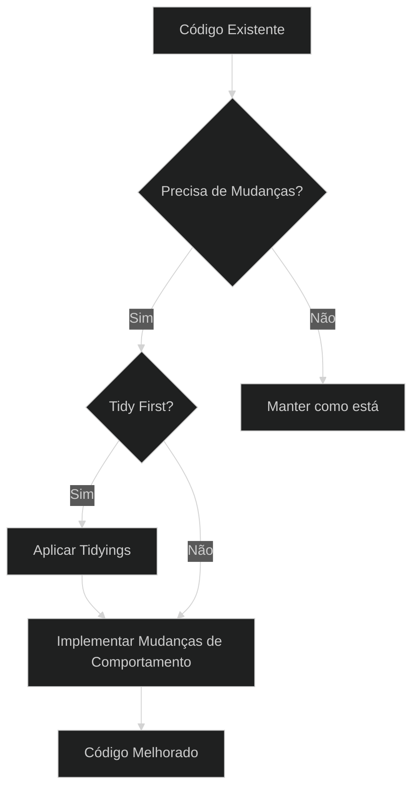
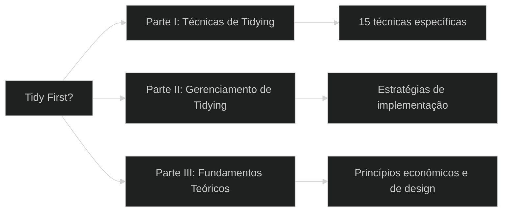
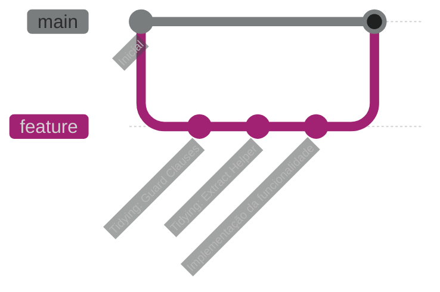
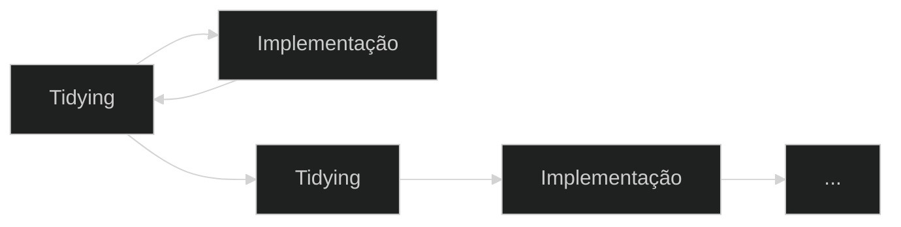
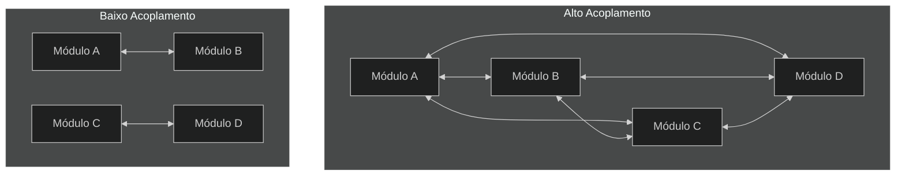
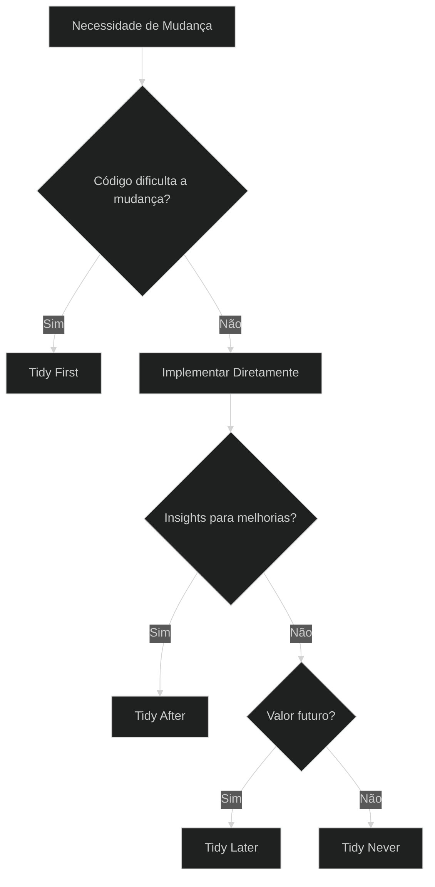
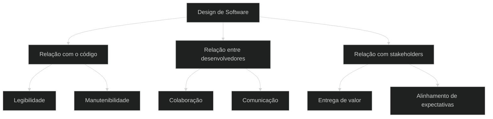
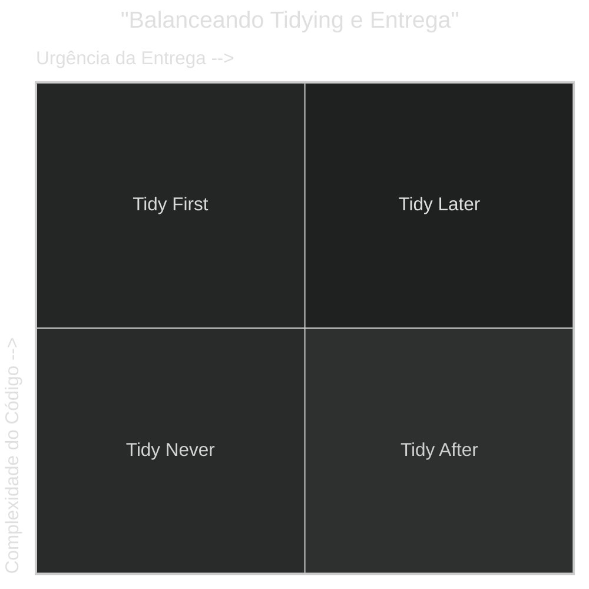
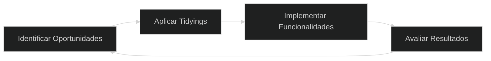

# Tidy First? - Uma Jornada pelo Design Empírico de Software
## Kent Beck


---

## Sobre o Autor

Kent Beck é uma figura central no desenvolvimento de software moderno:

- Criador da **Programação Extrema (XP)**
- Pioneiro em **Test-Driven Development (TDD)**
- Co-criador do **JUnit**
- Um dos signatários originais do **Manifesto Ágil**
- Atualmente Cientista-Chefe na **Mechanical Orchard**

Sua filosofia de desenvolvimento é centrada em práticas que tornam o código mais compreensível e a colaboração mais eficaz.

---

## O Que é "Tidy First?"

"Tidy First?" explora uma abordagem pragmática para melhorar o design de software através de pequenas mudanças estruturais incrementais antes de implementar novas funcionalidades.



O livro responde à pergunta: **"Quando vale a pena arrumar o código antes de fazer mudanças de comportamento?"**

---

## Conceito Central: "Tidying"

**Tidying** (Arrumação) refere-se a pequenas mudanças estruturais no código que:

- Melhoram a legibilidade e manutenibilidade
- São rápidas e seguras de implementar
- Não alteram o comportamento do software
- Facilitam futuras mudanças

> "Tidying não é sobre perfeição, mas sobre fazer o código mais fácil de entender e modificar."

Diferente de refatorações completas, tidyings são intervenções cirúrgicas precisas com escopo limitado.

---

## As Três Partes do Livro

O livro está organizado em três seções principais:



Cada parte aborda aspectos diferentes da prática de tidying, desde técnicas específicas até os fundamentos teóricos que as justificam.

---

## Parte I: Técnicas de Tidying

Beck apresenta 15 técnicas específicas de tidying, incluindo:

### 1. Guard Clauses (Cláusulas de Guarda)
Transforme condições aninhadas em retornos antecipados para simplificar o fluxo lógico.

**Antes:**
```java
void processRequest(Request request) {
    if (request != null) {
        if (request.isValid()) {
            // Lógica principal (muitas linhas)
        } else {
            throw new InvalidRequestException();
        }
    } else {
        throw new NullRequestException();
    }
}
```

**Depois:**
```java
void processRequest(Request request) {
    if (request == null) {
        throw new NullRequestException();
    }
    if (!request.isValid()) {
        throw new InvalidRequestException();
    }
    // Lógica principal (muitas linhas)
}
```

### 2. Dead Code (Código Morto)
Remova código que não é mais utilizado para melhorar a clareza e reduzir a carga cognitiva.

### 3. Explaining Variables/Constants
Introduza variáveis com nomes descritivos para explicar expressões complexas.

**Antes:**
```java
if (user.age >= 13 && user.age <= 19) {
    // Lógica para adolescentes
}
```

**Depois:**
```java
boolean isTeenager = user.age >= 13 && user.age <= 19;
if (isTeenager) {
    // Lógica para adolescentes
}
```

### 4. Extract Helper
Divida funções grandes em partes menores e mais focadas.

---

## Parte II: Gerenciamento de Tidying

Beck oferece estratégias práticas para implementar tidyings de forma eficaz:

### 1. Separate Tidying
Mantenha mudanças estruturais (tidying) separadas das mudanças de comportamento.



### 2. Batch Sizes
Mantenha os lotes de tidying pequenos para reduzir riscos e facilitar revisões.

### 3. Rhythm
Estabeleça um ritmo entre tidying e implementação de funcionalidades.



### 4. First, After, Later, Never
Uma estratégia para decidir quando aplicar tidyings:
- **First**: Quando facilitará a implementação imediata
- **After**: Quando você ganhou novos insights após a implementação
- **Later**: Quando não é urgente mas trará benefícios futuros
- **Never**: Quando o custo supera o benefício

---

## Parte III: Fundamentos Teóricos

Beck fundamenta suas recomendações práticas em princípios teóricos sólidos:

### 1. Acoplamento e Coesão



Kent Beck revisita esses conceitos clássicos sob a ótica do custo da mudança:

- **Acoplamento**: Mede como a mudança se espalha entre elementos. Dois elementos são acoplados se uma mudança em um **exige** uma mudança no outro. Alto acoplamento significa que pequenas alterações podem se propagar em cascata pelo sistema, aumentando o custo, o risco e a imprevisibilidade das modificações. Beck argumenta que o custo do software está diretamente relacionado ao acoplamento: `cost(software) ~= coupling`. Reduzir o acoplamento, especialmente em relação às mudanças mais prováveis, é crucial para controlar os custos.

- **Coesão**: Mede o quão bem os elementos dentro de um módulo estão funcionalmente relacionados, focando no custo da mudança **dentro** de um elemento. Um elemento (como uma função ou classe) é coeso se, quando uma mudança é necessária, **todo** o elemento precisa mudar. 
    - Se um elemento é **pouco coeso por ser grande demais** (faz muitas coisas), uma mudança afetará apenas uma parte dele, tornando mais difícil entender o impacto e, consequentemente, mais arriscada a modificação.
    - Se é **pouco coeso por ser pequeno demais** (faz apenas parte de uma tarefa), ele terá alto acoplamento com outros elementos que completam a tarefa, espalhando o custo da mudança.
    - Tidyings, como extrair métodos, frequentemente visam aumentar a coesão, tornando as unidades de código mais focadas e fáceis de modificar como um todo.

O objetivo do design, segundo Beck, é balancear esses fatores para minimizar o custo total das mudanças esperadas ao longo do tempo.

### 2. Economia do Design de Software
Beck aplica conceitos econômicos ao design de software:

- **Valor do dinheiro no tempo**: "Um dólar hoje vale mais que um dólar amanhã"
- **Opcionalidade**: O valor de manter opções abertas para o futuro
- **Fluxos de caixa descontados**: Balancear investimentos atuais vs. retornos futuros


### 3. Mudanças Estruturais Reversíveis
A maioria das decisões de design de software pode ser facilmente desfeita, permitindo experimentação com baixo risco.

> "Qual a diferença entre um corte de cabelo ruim e uma tatuagem ruim? O corte cresce, a tatuagem é para sempre."

---

## Quando Aplicar Tidying?

Beck oferece um framework para decidir quando aplicar tidying:



- **Tidy First**: Quando o código atual dificulta a implementação de novas funcionalidades
- **Tidy After**: Após ganhar novos insights com a implementação
- **Tidy Later**: Para melhorias que trarão valor no futuro
- **Tidy Never**: Quando o custo supera o benefício

---

## Design de Software como Relações Humanas

Um dos insights mais profundos do livro é a visão do design de software como um exercício em relações humanas:



> "Software design é um exercício em relações humanas."

O design eficaz considera como os desenvolvedores (atuais e futuros) interagirão com o código.

---

## Equilíbrio na Prática

Beck enfatiza a importância do equilíbrio:

- Entre perfeição e pragmatismo
- Entre investimento estrutural e entrega de valor
- Entre necessidades atuais e futuras



> "Tidy first? Likely yes. Just enough. You're worth it."

---

## Aplicações Práticas

Para aplicar os conceitos do livro em sua equipe:

1. **Comece pequeno**: Aplique técnicas simples de tidying em áreas problemáticas
2. **Estabeleça convenções**: Defina quando e como aplicar tidyings
3. **Separe commits**: Mantenha tidyings e mudanças de comportamento em commits separados
4. **Meça resultados**: Observe como tidyings afetam a velocidade de desenvolvimento
5. **Ajuste conforme necessário**: Adapte a abordagem com base nos resultados



---

## Conclusão: O Valor de "Tidy First?"

O livro oferece uma abordagem equilibrada para melhorar o design de software:

- **Pragmática**: Focada em melhorias incrementais e realistas
- **Econômica**: Baseada em princípios sólidos de investimento e retorno
- **Humana**: Centrada nas pessoas que interagem com o código

A mensagem central é que pequenas melhorias estruturais, aplicadas estrategicamente, podem ter um impacto significativo na qualidade e manutenibilidade do software ao longo do tempo.

> "O objetivo não é código perfeito, mas código que seja fácil de entender e modificar."

---

## Perguntas para Reflexão

1. Quais áreas do seu código atual se beneficiariam mais de tidyings?
2. Como você poderia incorporar o ritmo de tidying em seu processo de desenvolvimento?
3. Quais técnicas específicas de tidying parecem mais relevantes para seus desafios atuais?
4. Como você equilibra investimentos em estrutura de código com a pressão para entregar funcionalidades?
5. De que forma o conceito de "software design como relações humanas" ressoa com sua experiência?
