# Tidy First? - Uma Jornada pelo Design Empírico de Software
## Kent Beck


---

## Sobre o Autor

Kent Beck é uma figura central no desenvolvimento de software moderno:

- Criador da **Programação Extrema (XP)**
- Pioneiro em **Test-Driven Development (TDD)**
- Co-criador do **JUnit**
- Um dos signatários originais do **Manifesto Ágil**
- Atualmente Cientista-Chefe na **Mechanical Orchard**

Sua filosofia de desenvolvimento é centrada em práticas que tornam o código mais compreensível e a colaboração mais eficaz.

---

## O Que é "Tidy First?"

"Tidy First?" explora uma abordagem pragmática para melhorar o design de software através de pequenas mudanças estruturais incrementais antes de implementar novas funcionalidades.

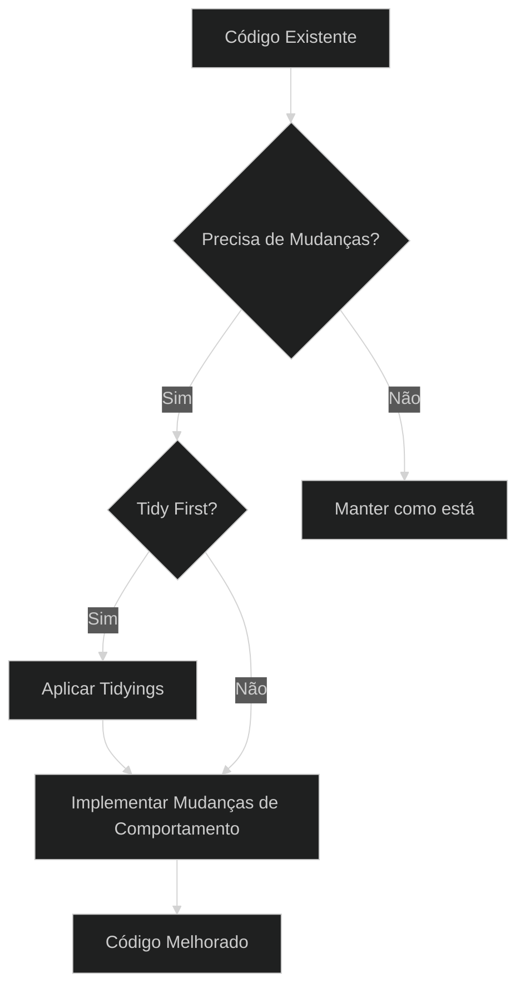

O livro responde à pergunta: **"Quando vale a pena arrumar o código antes de fazer mudanças de comportamento?"**

---

## Conceito Central: "Tidying"

**Tidying** (Arrumação) refere-se a pequenas mudanças estruturais no código que:

- Melhoram a legibilidade e manutenibilidade
- São rápidas e seguras de implementar
- Não alteram o comportamento do software
- Facilitam futuras mudanças

> "Tidying não é sobre perfeição, mas sobre fazer o código mais fácil de entender e modificar."

Diferente de refatorações completas, tidyings são intervenções cirúrgicas precisas com escopo limitado.

---

## As Três Partes do Livro

O livro está organizado em três seções principais:

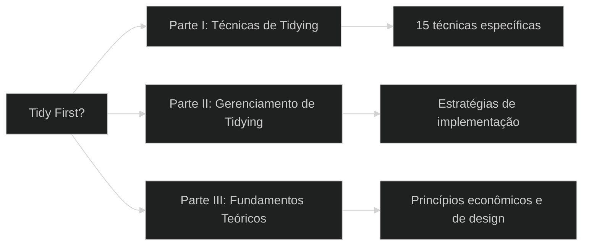

Cada parte aborda aspectos diferentes da prática de tidying, desde técnicas específicas até os fundamentos teóricos que as justificam.

---

## Parte I: Técnicas de Tidying

Beck apresenta **mais de 20 técnicas** específicas de tidying, incluindo:

### 1. Guard Clauses (Cláusulas de Guarda)
Transforme condições aninhadas em retornos antecipados para simplificar o fluxo lógico.

**Antes:**
```java
void processRequest(Request request) {
    if (request != null) {
        if (request.isValid()) {
            // Lógica principal (muitas linhas)
        } else {
            throw new InvalidRequestException();
        }
    } else {
        throw new NullRequestException();
    }
}
```

**Depois:**
```java
void processRequest(Request request) {
    if (request == null) {
        throw new NullRequestException();
    }
    if (!request.isValid()) {
        throw new InvalidRequestException();
    }
    // Lógica principal (agora menos indentada e mais clara)
}
```
*   **Comentário:** Simplifica condicionais aninhadas, verificando as condições de falha e saindo da função imediatamente. Isso torna o fluxo principal do código mais claro e fácil de ler.

### 2. Dead Code (Código Morto)
Remova código que não é mais utilizado para melhorar a clareza e reduzir a carga cognitiva. Confie no controle de versão para recuperá-lo se necessário.
*   **Comentário:** Remover pequenas porções por vez facilita a reversão caso algo dê errado.

### 3. Normalize Symmetries (Normalizar Simetrias)
Padronize a forma como tarefas semelhantes são codificadas. Evite usar múltiplos padrões para a mesma coisa.

**Exemplo (Formatação de Strings):**

**Antes (Inconsistente):**
```python
# Forma 1
log_message1 = "Error processing user: %s" % user_id
# Forma 2
log_message2 = "Task {} completed successfully.".format(task_id)
# Forma 3
log_message3 = f"Data loaded from {source_path}"
```

**Depois (Padronizado com f-strings):**
```python
log_message1 = f"Error processing user: {user_id}"
log_message2 = f"Task {task_id} completed successfully."
log_message3 = f"Data loaded from {source_path}"
```
*   **Comentário:** Variações desnecessárias aumentam a confusão. Use um estilo comum para funções, formatação, nomenclatura, etc.

### 4. New Interface, Old implementation (Nova Interface, Implementação Antiga)
Se uma interface existente é difícil de usar, crie uma nova interface mais simples e faça-a chamar a implementação antiga.

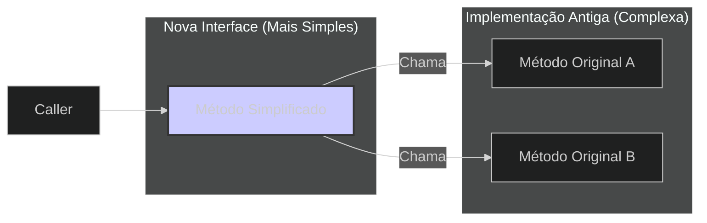
*   **Comentário:** Melhora a usabilidade sem reescrever a lógica complexa imediatamente. Útil para introduzir uma camada de abstração ou simplificar APIs legadas.

### 5. Reading Order (Ordem de Leitura)
Reorganize o código no arquivo na ordem em que um leitor preferiria encontrá-lo (ex: funções chamadoras antes das chamadas, fluxo principal primeiro).
*   **Comentário:** Facilita o acompanhamento da lógica do programa.

### 6. Cohesion Order (Ordem de Coesão)
Agrupe elementos fortemente relacionados (acoplados) juntos.

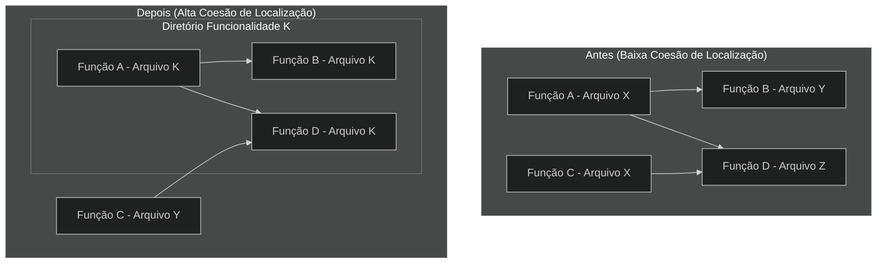
*   **Comentário:** Coloque funções relacionadas próximas no mesmo arquivo, e arquivos relacionados no mesmo diretório. Se puder eliminar o acoplamento, melhor ainda.

### 7. Move Declaration and Initialization Together (Mover Declaração e Inicialização para Perto do Uso)
Declare e inicialize variáveis o mais próximo possível de onde são usadas pela primeira vez.

**Antes:**
```java
void processItems(List<Item> items) {
    int totalValue = 0; // Declarada no início
    Map<String, Integer> categoryCounts = new HashMap<>(); // Declarada no início
    // ... muito código ...
    for (Item item : items) {
        totalValue += item.getValue(); // Usada aqui
        // ...
    }
    // ... mais código ...
    for (Item item : items) {
        categoryCounts.put(item.getCategory(), categoryCounts.getOrDefault(item.getCategory(), 0) + 1); // Usada aqui
    }
    // ...
}
```

**Depois:**
```java
void processItems(List<Item> items) {
    // ... muito código ...
    int totalValue = 0; // Declarada e inicializada perto do primeiro uso
    for (Item item : items) {
        totalValue += item.getValue();
        // ...
    }
    // ... mais código ...
    Map<String, Integer> categoryCounts = new HashMap<>(); // Declarada e inicializada perto do primeiro uso
    for (Item item : items) {
        categoryCounts.put(item.getCategory(), categoryCounts.getOrDefault(item.getCategory(), 0) + 1);
    }
    // ...
}
```
*   **Comentário:** Melhora a compreensão, evitando que o leitor precise procurar onde a variável foi definida.

### 8. Explaining Variables (Variáveis Explicativas)
Introduza variáveis com nomes descritivos para explicar expressões complexas ou partes delas. (Similar ao exemplo já existente, mas reforça o conceito).

**Antes:**
```python
if (order.total > 1000 and customer.years_active >= 5) or customer.is_vip:
    apply_special_discount(order)
```

**Depois:**
```python
is_high_value_order = order.total > 1000
is_long_term_customer = customer.years_active >= 5
should_apply_discount = (is_high_value_order and is_long_term_customer) or customer.is_vip

if should_apply_discount:
    apply_special_discount(order)
```
*   **Comentário:** Torna a condição principal mais legível. Faça isso em um commit separado da mudança de comportamento.

### 9. Explaining Constants (Constantes Explicativas)
Substitua valores literais (números mágicos, strings repetidas) por constantes simbólicas com nomes significativos.

**Antes:**
```javascript
if (keyCode === 27) { // O que é 27?
    closeDialog();
}
const apiUrl = "https://api.example.com/v1/users"; // Repetido em vários lugares
```

**Depois:**
```javascript
const ESCAPE_KEY_CODE = 27;
const API_BASE_URL = "https://api.example.com/v1";

if (keyCode === ESCAPE_KEY_CODE) {
    closeDialog();
}
const usersApiUrl = `${API_BASE_URL}/users`;
```
*   **Comentário:** Melhora a legibilidade e facilita a manutenção.

### 10. Explicit Parameters (Parâmetros Explícitos)
Evite passar grandes mapas ou objetos genéricos como parâmetros. Defina explicitamente os parâmetros que a função realmente precisa.

**Antes:**
```python
def create_user(user_data): # user_data é um dicionário {"name": ..., "email": ..., "prefs": ...}
    name = user_data.get("name")
    email = user_data.get("email")
    preferences = user_data.get("prefs", {})
    # ... usa name, email, preferences ...
```

**Depois:**
```python
def create_user(name, email, preferences={}): # Parâmetros explícitos
    # ... usa name, email, preferences ...
```
*   **Comentário:** Torna a assinatura da função clara sobre suas dependências e facilita o entendimento do que é necessário.

### 11. Chunk Statements (Agrupar Declarações)
Use linhas em branco para separar visualmente blocos de código que realizam tarefas distintas dentro de uma função.

**Antes:**
```python
def process_data(data):
    print("Validating data...")
    validated_data = validate(data)
    print("Transforming data...")
    transformed_data = transform(validated_data)
    print("Saving data...")
    save(transformed_data)
    print("Process finished.")
```

**Depois:**
```python
def process_data(data):
    print("Validating data...")
    validated_data = validate(data)

    print("Transforming data...")
    transformed_data = transform(validated_data)

    print("Saving data...")
    save(transformed_data)

    print("Process finished.")
```
*   **Comentário:** Uma organização simples que melhora a leitura e abre caminho para refatorações como Extrair Helper.

### 12. Extract Helper (Extrair Função Auxiliar)
Divida funções grandes em partes menores e mais focadas (helper/auxiliar). (Similar ao exemplo existente, mas reforça o conceito).

**Antes:**
```python
def generate_report(data):
    # Bloco 1: Validar dados (15 linhas)
    print("Validating...")
    # ... lógica de validação ...
    if not is_valid:
        raise ValueError("Invalid data")

    # Bloco 2: Calcular estatísticas (20 linhas)
    print("Calculating stats...")
    # ... lógica de cálculo ...

    # Bloco 3: Formatar saída (10 linhas)
    print("Formatting...")
    # ... lógica de formatação ...
    return formatted_report
```

**Depois:**
```python
def _validate_report_data(data):
    print("Validating...")
    # ... lógica de validação ...
    if not is_valid:
        raise ValueError("Invalid data")

def _calculate_report_stats(validated_data):
    print("Calculating stats...")
    # ... lógica de cálculo ...
    return stats

def _format_report_output(stats):
    print("Formatting...")
    # ... lógica de formatação ...
    return formatted_report

def generate_report(data):
    _validate_report_data(data)
    stats = _calculate_report_stats(data) # Assumindo que a validação não altera os dados
    report = _format_report_output(stats)
    return report
```
*   **Comentário:** Se um bloco de código tem um propósito claro e poucas interações com o restante, extraia-o.

### 13. One Pile (Uma Pilha Só)
Às vezes, o código é dividido em pedaços tão pequenos que se torna difícil entender o todo. Reúna essas partes novamente para ter uma visão clara e, então, extraia novas partes mais coesas.
*   **Comentário:** É o inverso de "Extract Helper". O custo de leitura é muitas vezes maior que o de escrita; às vezes, juntar facilita a compreensão antes de dividir melhor.

### 14. Explaining Comments (Comentários Explicativos)
Escreva comentários apenas para explicar o *porquê* de algo, ou informações que não são óbvias diretamente pelo código.

**Exemplo de Comentário Ruim (Redundante):**
```python
# Incrementa o contador
count = count + 1
```

**Exemplo de Comentário Bom (Explica o porquê):**
```python
# Precisamos incrementar manualmente pois estamos em um loop complexo
# que não permite o uso de enumerate ou similar.
count = count + 1
```
*   **Comentário:** Coloque-se no lugar de quem lerá o código no futuro. Um bom momento para comentar é ao descobrir um defeito, explicando o problema.

### 15. Delete Redundant Comments (Remover Comentários Redundantes)
Se um comentário apenas repete o que o código já diz claramente, remova-o.
*   **Comentário:** Comentários redundantes poluem o código e podem ficar desatualizados. (Veja exemplo no item 14).

---

## Parte II: Gerenciamento de Tidying

Beck oferece estratégias práticas para implementar tidyings de forma eficaz:

### 1. Separate Tidying (Organização Separada)
Mantenha mudanças estruturais (tidying) separadas das mudanças de comportamento.

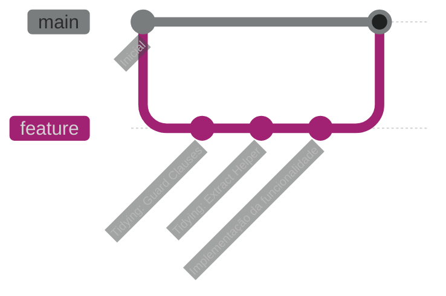

### 2. Batch Sizes
Mantenha os lotes de tidying pequenos para reduzir riscos e facilitar revisões.

### 3. Rhythm
Estabeleça um ritmo entre tidying e implementação de funcionalidades.

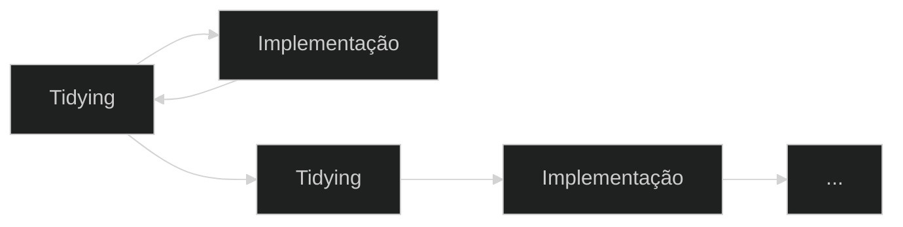

### 4. First, After, Later, Never
Uma estratégia para decidir quando aplicar tidyings:
- **First**: Quando facilitará a implementação imediata
- **After**: Quando você ganhou novos insights após a implementação
- **Later**: Quando não é urgente mas trará benefícios futuros
- **Never**: Quando o custo supera o benefício

### 5. Chaining (Encadeamento)
Uma organização pode facilitar a próxima. Você pode encadear pequenas organizações para alcançar mudanças estruturais maiores.
*   **Comentário:** Tenha cuidado para não mudar demais de uma vez, pois falhas em grandes organizações são custosas. Exemplo: Mover declaração -> Extrair variável -> Extrair método.

### 6. Getting Untangled (Desembaraçando)
Se você se encontrar em uma longa cadeia de organizações interdependentes em um único PR/branch, avalie:
1.  **Enviar como está:** Rápido, mas pode ser confuso e arriscado.
2.  **Separar em PRs menores:** Mais trabalho manual, mas mais claro e seguro.
3.  **Começar de novo (organizando primeiro em commits/PRs separados):** Mais trabalho ainda, mas resulta em um histórico limpo e pode levar a novas ideias.
*   **Comentário:** Reimplementar (opção 3) pode ajudar a ver o problema de forma diferente.

---

## Parte III: Fundamentos Teóricos

Beck fundamenta suas recomendações práticas em princípios teóricos sólidos:

### 1. Acoplamento e Coesão

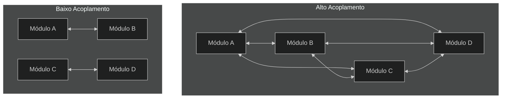

Kent Beck revisita esses conceitos clássicos sob a ótica do custo da mudança:

- **Acoplamento**: Mede como a mudança se espalha entre elementos. Dois elementos são acoplados se uma mudança em um **exige** uma mudança no outro. Alto acoplamento significa que pequenas alterações podem se propagar em cascata pelo sistema, aumentando o custo, o risco e a imprevisibilidade das modificações. Beck argumenta que o custo do software está diretamente relacionado ao acoplamento: `cost(software) ~= coupling`. Reduzir o acoplamento, especialmente em relação às mudanças mais prováveis, é crucial para controlar os custos.

- **Coesão**: Mede o quão bem os elementos dentro de um módulo estão funcionalmente relacionados, focando no custo da mudança **dentro** de um elemento. Um elemento (como uma função ou classe) é coeso se, quando uma mudança é necessária, **todo** o elemento precisa mudar. 
    - Se um elemento é **pouco coeso por ser grande demais** (faz muitas coisas), uma mudança afetará apenas uma parte dele, tornando mais difícil entender o impacto e, consequentemente, mais arriscada a modificação.
    - Se é **pouco coeso por ser pequeno demais** (faz apenas parte de uma tarefa), ele terá alto acoplamento com outros elementos que completam a tarefa, espalhando o custo da mudança.
    - Tidyings, como extrair métodos, frequentemente visam aumentar a coesão, tornando as unidades de código mais focadas e fáceis de modificar como um todo.

O objetivo do design, segundo Beck, é balancear esses fatores para minimizar o custo total das mudanças esperadas ao longo do tempo.

### 2. Economia do Design de Software
Beck aplica conceitos econômicos ao design de software:

- **Valor do dinheiro no tempo**: "Um dólar hoje vale mais que um dólar amanhã"
- **Opcionalidade**: O valor de manter opções abertas para o futuro
- **Fluxos de caixa descontados**: Balancear investimentos atuais vs. retornos futuros


### 3. Mudanças Estruturais Reversíveis
A maioria das decisões de design de software pode ser facilmente desfeita, permitindo experimentação com baixo risco.

> "Qual a diferença entre um corte de cabelo ruim e uma tatuagem ruim? O corte cresce, a tatuagem é para sempre."

### 4. Beneficially Relating Elements (Relacionando Elementos Beneficamente)
Design de software é sobre relacionar elementos (tokens, expressões, funções, módulos, sistemas) de forma benéfica. As relações comuns são invocações, publicações, escutas, referências. O designer pode criar/deletar elementos e relações, ou ajustar relações para aumentar o benefício.

**Exemplo: Simplificando uma Chamada**

**Antes (Duas chamadas, mais acoplamento no chamador):**
```python
# Chamador
width = box.get_width()
height = box.get_height()
area = width * height # Lógica de cálculo no chamador
```

**Depois (Uma chamada, menos acoplamento, lógica encapsulada):**
```python
# Classe Box
class Box:
    # ...
    def get_area(self):
        return self.get_width() * self.get_height()

# Chamador
area = box.get_area() # Lógica dentro do objeto Box
```
*   **Comentário:** A segunda versão move a responsabilidade de calcular a área para a classe `Box`, reduzindo o acoplamento do chamador com os detalhes internos de `Box`. O benefício é a simplicidade no chamador; o custo é um método adicional em `Box`.

### 5. Structure and Behavior (Estrutura e Comportamento)
Software agrega valor de duas formas:
-   **Comportamento:** O que ele faz hoje (calcular, exibir, salvar, etc.). Isso gera valor direto.
-   **Estrutura:** A facilidade com que podemos adicionar novas funcionalidades amanhã. Isso cria *opções* de valor futuro.
*   **Comentário:** Tidyings focam em melhorar a estrutura para habilitar ou facilitar futuras mudanças de comportamento.

### 6. Economics: Time Value and Optionality (Economia: Valor do Tempo e Opcionalidade)
Dois princípios econômicos influenciam o design:
1.  **Valor do Tempo:** Dinheiro (ou esforço) hoje vale mais que amanhã. Incentiva a entregar valor (comportamento) mais cedo e adiar custos (organização complexa) -> Tende a favorecer "Tidy After" ou "Tidy Later".
2.  **Opcionalidade:** Em cenários incertos, opções (flexibilidade para mudar no futuro) valem mais que coisas concretas (implementações rígidas). Incentiva a investir em boa estrutura para manter opções abertas -> Tende a favorecer "Tidy First".
*   **Comentário:** O design de software busca reconciliar esses dois imperativos, decidindo quando investir em estrutura (opcionalidade) versus entregar comportamento (valor imediato).

---

## Quando Aplicar Tidying?

Beck oferece um framework para decidir quando aplicar tidying:

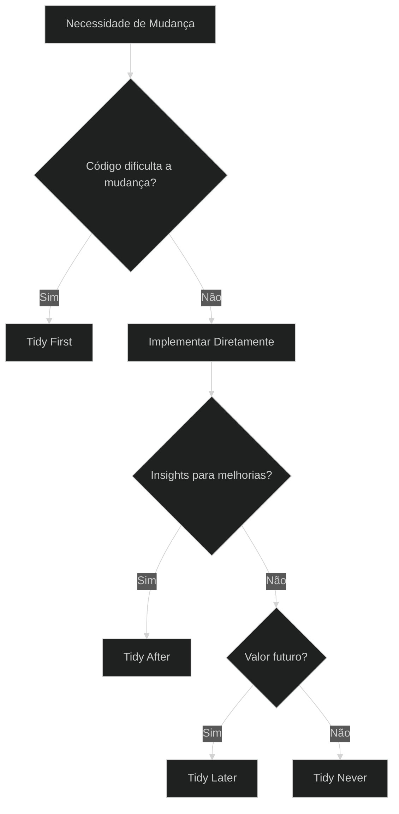

- **Tidy First**: Quando o código atual dificulta a implementação de novas funcionalidades
- **Tidy After**: Após ganhar novos insights com a implementação
- **Tidy Later**: Para melhorias que trarão valor no futuro
- **Tidy Never**: Quando o custo supera o benefício

---

## Design de Software como Relações Humanas

Um dos insights mais profundos do livro é a visão do design de software como um exercício em relações humanas:

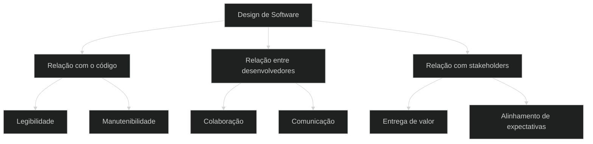

> "Software design é um exercício em relações humanas."

O design eficaz considera como os desenvolvedores (atuais e futuros) interagirão com o código.

---

## Equilíbrio na Prática

Beck enfatiza a importância do equilíbrio:

- Entre perfeição e pragmatismo
- Entre investimento estrutural e entrega de valor
- Entre necessidades atuais e futuras

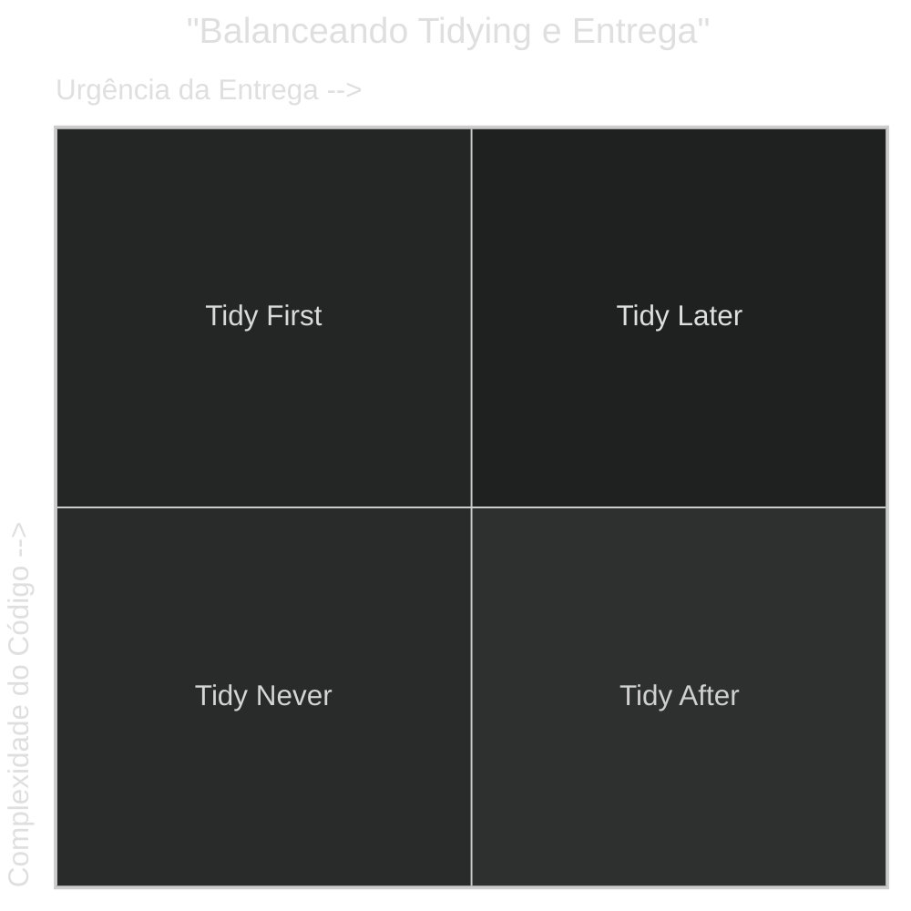

> "Tidy first? Likely yes. Just enough. You're worth it."

---

## Aplicações Práticas

Para aplicar os conceitos do livro em sua equipe:

1. **Comece pequeno**: Aplique técnicas simples de tidying em áreas problemáticas
2. **Estabeleça convenções**: Defina quando e como aplicar tidyings
3. **Separe commits**: Mantenha tidyings e mudanças de comportamento em commits separados
4. **Meça resultados**: Observe como tidyings afetam a velocidade de desenvolvimento
5. **Ajuste conforme necessário**: Adapte a abordagem com base nos resultados

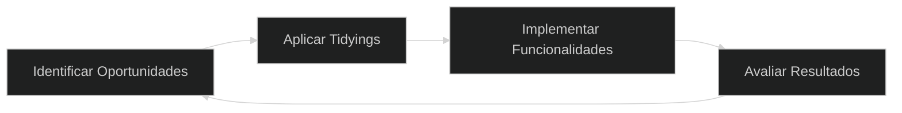

---

## Conclusão: O Valor de "Tidy First?"

O livro oferece uma abordagem equilibrada para melhorar o design de software:

- **Pragmática**: Focada em melhorias incrementais e realistas
- **Econômica**: Baseada em princípios sólidos de investimento e retorno
- **Humana**: Centrada nas pessoas que interagem com o código

A mensagem central é que pequenas melhorias estruturais, aplicadas estrategicamente, podem ter um impacto significativo na qualidade e manutenibilidade do software ao longo do tempo.

> "O objetivo não é código perfeito, mas código que seja fácil de entender e modificar."

---

## Perguntas para Reflexão

1. Quais áreas do seu código atual se beneficiariam mais de tidyings?
2. Como você poderia incorporar o ritmo de tidying em seu processo de desenvolvimento?
3. Quais técnicas específicas de tidying parecem mais relevantes para seus desafios atuais?
4. Como você equilibra investimentos em estrutura de código com a pressão para entregar funcionalidades?
5. De que forma o conceito de "software design como relações humanas" ressoa com sua experiência?
